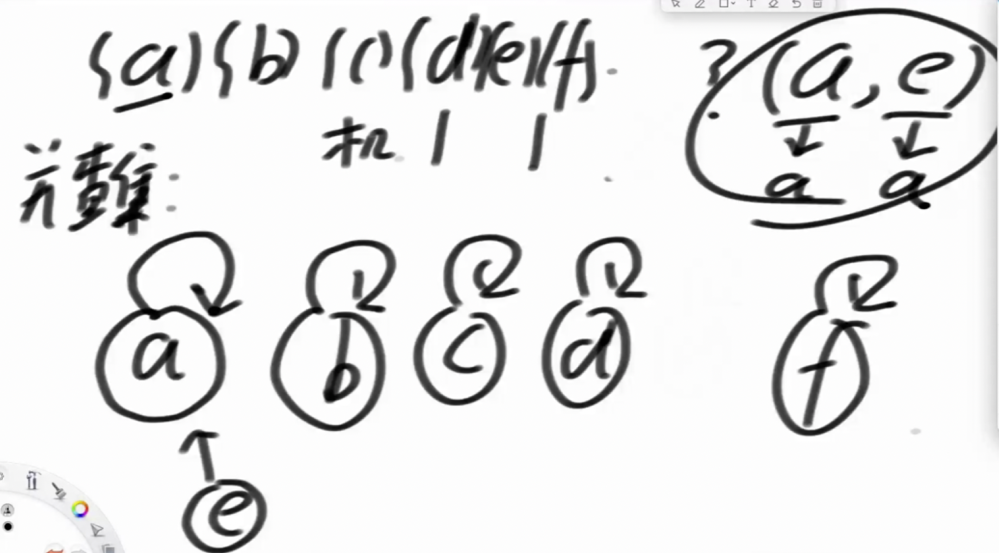
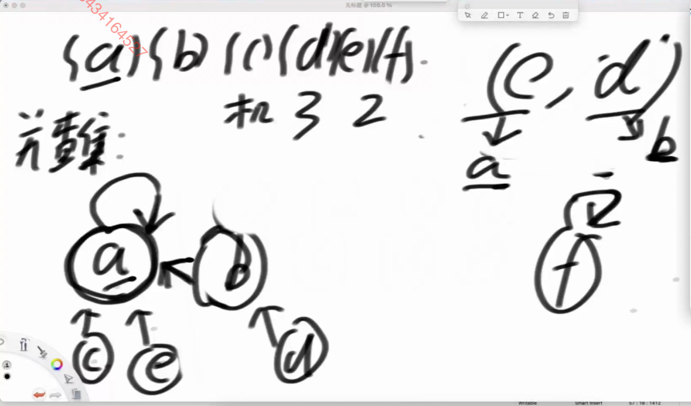

# 并查集

## 描述

- `a b c d e` 这几个样本 都在 各自的集合里面
- `{a} {b} {c} {d} {e}`
- 有两个方法
- 1.  `union(a,b) void `合并 `a `所在的集合 `b `所在的集合
- 2.  `isSameSet(a,b) boolean` 判断 `a b` 是否在同一个集合里面

## 时间复杂度

- 并查集的时间复杂度 O(1)
- 如果有 N 个 样本 调用 isSameSet 和 union 很频繁， 可以做到 均摊下来是 O(1)的时间复杂度
- 均摊的意思 是 例如 有 100 万个样本，我调用 100 亿次 isSameSet 和 union 那么每次调用的时间是常数级别的

## 结构实现

每个集合的每个元素都有一个指针指向父级，最顶层的元素指向自己，

- `union(a,b)` 只需一直向上 查找 如果找到了 相同的顶级节点 就是证明在一个集合中
- `isSameSet(a,b)` 合并集合只需 把 `b`所在的集合 指向 `a`所在的集合, 集合挂载 遵循 小挂大的 原则，例如 `a` 集合的长度为 2，`c` 集合的长度为 1，则 `c` 集合合并到 `a` 集合上，此时 `a` 集合会挂载 `b` 集合 和 `c` 集合
  
  
