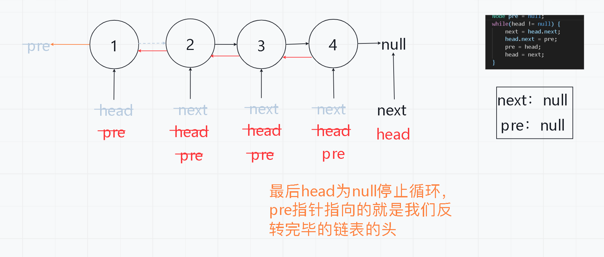
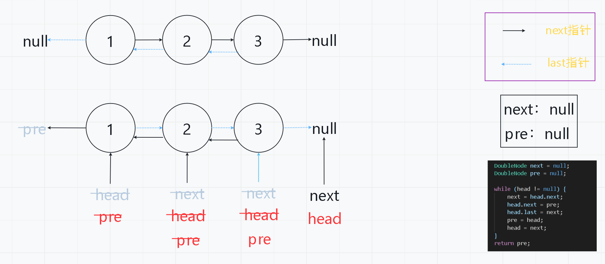

## 1. 基础链表反转问题

- 单链表反转


- 双链表反转

```java
public class Code01_ReverseList {

    //单链表 只有一个指针
	public static class Node{
		public int value;
		public Node next;
		
		public Node(int data) {
			value = data;
		}
	}
	// 双链表 存在两个指针
	public static class DoubleNode{
		public int value;
		public DoubleNode last;
		public DoubleNode next;
		
		public DoubleNode(int data) {
			value = data;
		}
	}
	
	/**
        单链表反转：
        两个指针，next指针用来记录头指针的下一个指针，
        pre指针用来记录已经反转好的链表    
    */
	public static Node reverseLinkedList(Node head) {
		
		Node next = null;
		Node pre = null;
		while(head != null) {
			next = head.next;
			head.next = pre;
			pre = head;
			head = next;
		}
		
		return pre;
	}
	
    /**
        双链表反转：
        两个指针，next指针用来记录头指针的下一个指针，
        pre指针用来记录已经反转好的链表，比单链表多一步，
        在反转的过程中也要把last指针反转    
    */
	public static DoubleNode reverseDoubleLinkedList(DoubleNode head) {
		DoubleNode next = null;
		DoubleNode pre = null;
		
		while (head != null) {
			next = head.next;
			head.next = pre;
			head.last = next;
			pre = head;
			head = next;
		}
		return pre;
	}
	
}
```

## 2. 给定链表头和一个值删除对应值的节点

```java
public class Code02_DeleteGivenValue {
	public static class Node{
        public int value;
        public Node next;
        public Node(int data){
            value = data;
        }
    }
    
    public static Node removeValue(Node head, int num){
        while(head != null){
            if(head.value != num){
                break;
            }
            head = head.next;
        }
        Node pre = head;
        Node cur = head;
        while(cur != null){
            if(cur.value == num){
                pre.next = cur.next;
            }else{
                pre = cur;
            }
            cur = cur.next;
        }
        return head;
    }
    
}
```

## 3. 双链表实现双端队列

```java
public class Code03_DoubleEndsQueueToStackAndQueue{
    public static class Node<T>{
        public T value;
        public Node<T> next;
        public Node<T> last;
        
        public Node(T data){
            value = data;
        }
    }
    
    public static class DoubleEndsQueue<T>{
        public Node<T> head = null;
        public Node<T> tail = null;
        public void addFromHead(T value){
            Node<T> cur = new Node<T>(value);
            if(head == null){
                head = cur;
                tail = cur;
            }else{
                cur.next = head;
                head.last = cur;
                head = cur;	
            }
        }
        public void addFromBottom(T value){
            Node<T> cur = new Node<T>(value);
            if(head == null){
                head = cur;
                tail = cur;
            }else{
                cur.last = tail;
                tail.next = cur;
                tail = cur;
            }
        }
        
        public T popFromHead(){
            if(head == null){
                return null;
            }
            Node<T> cur = head;
            if(head == tail){
                head = null;
                tail = null;
            }else{
                head = head.next;
                head.last = null;
                cur.next = null;
            }
            return cur.value;
        }
        public T popFromBottom(){
            if(head == null){
                return null;
            }
            Node<T> cur = tail;
            if(head == tail){
                head = null;
                tail = null;
            }else{
                tail = tail.last;
                tail.next = null;
                cur.last = null;
            }
            return cur.value;
        }
        public boolean isEmpty(){
            return head == null;
        }
    }
}
```


