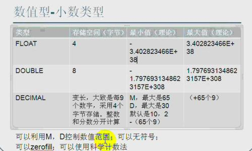

# 1. 数据库能够做什么

存储大量数据，方便检索和访问
保持数据信息的一致、完整
共享和安全
通过组合分析，产生新的有用信息

# 2. 数据库的基本概念

## 2.1 实体

只要是在客观世界存在的、可以被描述出来的都是实体

## 2.2 数据库(DB)

数据库就是数据的仓库，可以存放结构化的数据

## 2.3 数据库管理系统(DBMS)

是一种系统软件，提供操作数据库的环境，可以通过数据库管理系统对数据进行插入、修改、删除和查询等操作。
例如 navicat。

## 2.4 SQL

结构化查询语言 专门用来和数据库进行交流的语言,几乎所有的 DBMS 都支持 SQL

## 2.5 SQL 规范

- SQL 语句不区分大小写，建议 SQL 关键字大写，表名和列表小写
- 命令用分号结尾
- 命令可以缩进和换行，一种类型的关键字放在一行
- 可以写单行和多行注释 , #和--是单行注释，/\*\*\*/多行注释

# 3. 数据表

- 表是数据库中包含所有数据的数据库对象，也是其它对象的基础。
- 表定义是一个列的集合，数据在表中是按行和列的格式组织的，用来存放数据
- 行也称为记录用来存放一个个实体，列称为字段用来描述实体的某一个属性

# 4.MYSQL 简介

## 4.1 MYSQL 特点

开源免费
性能高
安装使用都简单

## 4.2 MYSQL 安装

- [mysql 下载](https://dev.mysql.com/downloads/mysql/5.5.html)

- 安装 MYSQL

## 4.3 MYSQL 配置

- C:\Program Files\MySQL\MySQL Server 5.5\my.ini

- port 端口号

- basedir 安装目录

- datadir 数据存放访目录

- character_set_server 字符集

- default-storage-engine 存储引擎

- sql-mode 语法模式

- max-connections 最大连接数

## 4.4 MYSQL 启动和停止

`net start MySQ`
`net stop MySQL`

## 4.5 通过命令行连接 MYSQL

`mysql -h 127.0.0.1 -P 3306 -uroot -p123456
exit`

## 4.6 切换数据库

`use test;`

## 4.7 显示有哪些表

`show tables;`
`show tables from mysql;`

## 4.8 显示当前数据库

`select database();`

## 4.9 查询表结构

`DESC user;`

# 5.创建表

- 学生表
  
- 课程表
  
- 成绩表
  

# 6. 数据完整性

为了实现数据完整性，需要检验数据库表中的每行和每列数据是否符合要求
在创建表的时候，应该保证以后的数据输入是正确的，错误的数据不允许输入

## 6.1 域完整性

不同的字段需要设置为各种合适的类型，比如年龄就是整数类型




## 6.2 默认值

默认值是指如果用户没有指定值的情况下会记录的此字段指定一个提供一个预先设定的值

> 可以把居住地默认值设置为北京

## 6.3 非空约束

我们可以指定某个字段不能不输入，必须提供一个非空的值

> 姓名字段不能为空

# 7.实体完整性

## 7.1 主键约束

表中一列或者几列组合的值能用来唯一标识表中的每一行，这样的列或者列组合称为表的主键，主键表的数据不同重复。

如果两列或者多列组合起来唯一标识表中的每一行，则该主键又称为"组合键"

- 设置成绩表的 `student_id` 为主键, 课程表有三门课程, 学生表有两名学生。
  
  
  
- 当给成绩表记录小明的语文成绩和小明的数学成绩时，会报错
  
- 此时可以将 `course_id` 也设置成为主键，使用两个主键组合起来唯一标识表中的每一行
  
  

主键的选择标准

- 最少性 尽量选择单个键作为主键

- 稳定性 ，由于主键是用来在两个表间建立联接的，所以不能经常更新，最好就不更新

## 7.2 外键

成绩表中的学生 ID 应该在学生表中是存在的 我们应该让成绩表中的 ID 只能引用学生表中的 ID，它们的值应该是一一对应的，也就是说成绩表中的 ID 是成绩表中的外键，对应学生表的主键 ，这样就可以保证数据的引用完整性

## 7.3 唯一约束

唯一约束是指某个字段值是唯一的，在所有的记录中不能有重复的值.

> 学生的身份证号可以设置为唯一约束

## 7.4 标识列

- 当表中没有合适的列作为主键时可以考虑增加标识列，标识列是一个无实际业务含义的列，仅仅用来区分每条记录。
- 标识列的值是自动生成的，不能在该列上输入数据

## 7.5 外键约束


一个表的外键必须引用另一个表的主键,比如成绩表中的学生 ID 会引用学生表的主键，课程 ID 会引用成绩表的主键

- 主表没有记录，子表中不能添加相应的记录，必须先添加主表的记录，然后才能添加子表的记录
- 修改和删除主表记录不能让子表记录孤立，必须先相应修改和删除子表

# 8. 数据操作

## 8.1 创建学生表

```sql
CREATE TABLE `student` (
`id`  int(11) NOT NULL PRIMARY KEY AUTO_INCREMENT,
`name`  varchar(64) NOT NULL,
`age`  int(11) NULL DEFAULT NULL,
`city`  varchar(64) DEFAULT '北京',
)
```


## 8.2 增加身份证号字段

```sql
ALTER TABLE `student` ADD COLUMN `idcard` VARCHAR(15) NULL AFTER `city`; -- 增加idcard字段

ALTER TABLE `student` MODIFY COLUMN `idcard` VARCHAR(18) NULL AFTER `name`; -- 修改idcard字段

ALTER TABLE `student`DROP COLUMN `idcard`; -- 删除idcard字段
```


## 8.3 添加约束

```sql
-- 主键约束
ALTER TABLE `student` ADD PRIMARY KEY (`id`);
-- 唯一约束
ALTER TABLE `student` ADD UNIQUE INDEX `uq_idcard` (`idcard`) ;
-- 默认约束
ALTER TABLE `student` MODIFY COLUMN `city`  varchar(50)  DEFAULT '北京' AFTER `age`;
-- 外键约束
ALTER TABLE `score` ADD CONSTRAINT `fk_stuid` FOREIGN KEY (`student_id`) REFERENCES `student` (`id`);
-- 删除约束
ALTER TABLE `score` DROP FOREIGN KEY `fk_stuid`;

```

# 9. SQL

## 9.1 SQL 是什么

Structured Query Language：结构化查询语言

## 9.2 为什么要用 SQL

使用界面操作数据库不方便
我们需要通过应用程序去操作数据库

## 9.3 SQL 组成

### 9.3.1 DDL（data definition language）是数据定义语言

主要的命令有 CREATE、ALTER、DROP 等，DDL 主要是用在定义或改变表（TABLE）的结构，数据类型，表之间的链接和约束等初始化工作上，他们大多在建立表时使用

### 9.3.2 DML（data manipulation language）是数据操纵语言

它们是 SELECT、UPDATE、INSERT、DELETE`，就象它的名字一样，这 4 条命令是用来对数据库里的数据进行操作的语言

### 9.3.3 DCL（DataControlLanguage）是数据库控制语言

是用来设置或更改数据库用户或角色权限的语句，包括（grant,revoke 等）语句

## 9.4 SQL 运算符

是一种符号，它是用来进行列间或者变量之间的比较和数学运算的

### 9.4.1 算术运算符

运算符 说明

- 加运算，求两个数或表达式相加的和，如 1+1

* 减少减运算，求两个数或表达式相减的差，如 4-1

- 乘运算，求两个数或表达式相乘的积，如 2\*2
  / 除运算，求两个数或表达式相除的商，如 6/4 的值为 1
  % 取模运算，求两个数或表达式相除的余数，如：6%4 的值为 2
  查询姓名全称

### 9.4.2 逻辑运算符

运算符 说明
AND 当且仅当两个布尔表达式都为 true 时，返回 TRUE
OR 当且仅当两个布尔表达式都为 false，返回 FALSE
NOT 布尔表达式的值取反

### 9.4.3 比较运算符

| 运算符 | 说明     |
| ------ | -------- |
| =      | 等于     |
| >      | 大于     |
| <      | 小于     |
| <>     | 不等于   |
| >=     | 大于等于 |
| <=     | 小于等于 |
| !=     | 不等于   |

## 9.5 查询窗口


## 9.6 数据操作语言

### 9.6.1 插入数据行

#### 9.6.1.1 语法

```sql
 INSERT  INTO/**可以省略INTO */  [表名][(列名)] VALUES  (值列表)
```

#### 9.6.1.2 插入记录

向学生表插入一条记录

```sql
INSERT student(naem,idcard,age,city) VALUES ('小兰','01',10,'北京')

```

#### 9.6.1.3 注意事项

- 每次插入一行数据，不能只插入一部分数据，插入的数据是否有效将按照整行的完整性要求来检验
- 每个数据值的数据类型、精度、位数必须与要应的列名精确匹配
- 不能为标识符指定值(例如 `id` 字段 是数据库自己维护的)
- 如果某字段设置为不能为空，则必须插入数据
- 插入数据时还要符合检查性约束的要求
- 有缺省值的列，可以使用 DEFAULT 关键字来代替插入实际的值

### 9.6.2 更新数据行

#### 9.6.2.1 语法

```sql
UPDATE 表名 SET 列名 = 更新值 [WHERE 更新条件]
```

#### 9.6.2.2 更新记录

更新 ID 等于 7 的学生年龄改为 40，城市改为上海

```sql
UPDATE student
 SET age = 19,city = '上海'
WHERE id=1
```

#### 9.6.2.3 注意

- 多列时用逗号隔开，一定要加更新条件以免错误更新
- 多个联合条件使用 AND id=7 and idcard='410787'
- 判断某字段是否为空 email is null or email = ''

### 9.6.3 删除数据

#### 9.6.3.1 语法

```sql
DELETE FROM [表名] [WHERE <删除条件>]
```

#### 9.6.3.2 删除记录

删除 ID=7 的学生记录

```sql
DELETE FROM student WHERE id=7
```

#### 9.6.3.3 注意

- Delete 语句是对整行进行操作，因此不需要提供列名
- 如果要删除主表数据，则要先删除子表记录

### 9.6.4 TRUNCATE 截断表

截断整个表中的数据，重置标识种子，不写入日志，没有备份

#### 9.6.4.1 语法

```sql
TRUNCATE TABLE 表名
```

#### 9.6.4.2 截断学生表

```sql
TRUNCATE TABLE student
```

> 数据全部清空,但表结构、列、约束等不被改动 不能用于有外键约束引用的表 标识列重新开始编号 因为要删除的数据不会写入日志，数据也不能恢复，所以工作中请尽量不要使用此命令

## 9.7 数据查询

- 查询就是从客户端 发出查询请求数据库服务器，并从数据库返回查询结果的过程
- 每次执行查询只是从数据表中提取数据，并按表的方式呈现出来
- 查询产生的是虚拟表,并不会保存起来

### 9.7.1 查询

#### 9.7.1.1 语法

```sql
SELECT    <列名>
FROM      <表名>
[WHERE    <查询条件表达式>]
[ORDER BY <排序的列名>[ASC或DESC]]
```

#### 9.7.1.2 排序

- 查询北京的同学信息 并按 id 倒叙排列

```sql
  SELECT id, `name`
  FROM student
  WHERE city='北京'
  ORDER BY id DESC
```

#### 9.7.1.3 别名

- `AS` 可以省略

```sql
  SELECT id, `name`, city AS home -- city  home
  FROM student
  WHERE city='北京'
  ORDER BY id DESC
```

#### 9.7.1.4 查询空行

```sql
  SELECT *
  FROM student
  WHERE level IS NULL
```

#### 9.7.1.5 常量列

```sql
  SELECT id, `name`, city AS home, '中国' AS country
  FROM student
  WHERE city='北京'
  ORDER BY id DESC
```

#### 9.7.1.6 限制返回的行数

```sql
  SELECT id,name,age,city,'中国' as country
  FROM student limit 2  --查询两条
  SELECT id,name,age,city,'中国' as country
  FROM student limit 3,2 --从第三条开始查询两条
```

##### 9.7.1.7 DISTINCT

查询同学们一共来自哪些不同的城市

```sql
  SELECT  DISTINCT city
  FROM student
```

#### 9.7.1.8 +

在 MYSQL 中+号只能用作于数字

```sql
SELECT 1+1  --2
SELECT 1+'1' --2
SELECT 1+'zfpx' --1
SELECT 1+null --null
SELECT CONCAT(`name`,city) FROM student --小明北京
```

#### 9.7.1.7 练习

##### 9.7.1.7.1 准备数据

```sql
ALTER TABLE `student`
ADD COLUMN `province`  varchar(50) NULL AFTER `city`,
ADD COLUMN `birthday`  date NULL AFTER `province`,
ADD COLUMN `gender`   int(11) NULL AFTER `birthday`,
ADD COLUMN `email`  varchar(50) NULL AFTER `gender`;
```

```sql
INSERT INTO `student`(id,name,gender,age,city,province,birthday,idcard,email) VALUES ('1', '郭靖', '1', '1', '济南', '山东省', '1982-09-03', 1, '1@qq.com');
INSERT INTO `student`(id,name,gender,age,city,province,birthday,idcard,email) VALUES ('2', '黄蓉', '2', '2', '济南', '山东省', '1982-09-03', 0, '2@qq.com');
INSERT INTO `student`(id,name,gender,age,city,province,birthday,idcard,email) VALUES ('3', '杨过', '3', '3', '终南山', '陕西省', '1979-09-03', 1, '3@qq.com');
INSERT INTO `student`(id,name,gender,age,city,province,birthday,idcard,email) VALUES ('4', '小龙女', '4', '4', '终南山', '陕西省', '1970-09-03', 0, '4@qq.com');
INSERT INTO `student`(id,name,gender,age,city,province,birthday,idcard,email) VALUES ('5', '欧阳锋', '5', '5', '白驼山', '新疆', '1989-09-09', 1, '5@qq.com');


INSERT INTO `course` VALUES ('1', '语文');
INSERT INTO `course` VALUES ('2', '数学');
INSERT INTO `course` VALUES ('3', '英语');

INSERT INTO `score` VALUES ('1', '1', '100');
INSERT INTO `score` VALUES ('1', '2', '90');
INSERT INTO `score` VALUES ('1', '3', '70');
INSERT INTO `score` VALUES ('2', '1', '100');
INSERT INTO `score` VALUES ('2', '2', '90');
INSERT INTO `score` VALUES ('2', '3', '80');
INSERT INTO `score` VALUES ('3', '1', '100');
INSERT INTO `score` VALUES ('3', '2', '90');
INSERT INTO `score` VALUES ('3', '3', '80');

```

##### 9.7.1.7.2 查询山东省的同学全部信息

```sql
select * from student where province = '山东省';

```

##### 9.7.1.7.3 查询山东省的男同学的全部信息

```sql
SELECT * FROM student WHERE province='山东省' AND gender=1;
```

##### 9.7.1.7.4 查询没有填写电子邮箱的同学的姓名和身份证号

```sql
SELECT name,idcard FROM student WHERE email IS NULL;
```

#### 9.7.1.8 排序

##### 9.7.1.8.1 把学生的分数按升序排列

```sql
SELECT * FROM score ORDER BY grade ASC
```

##### 9.7.1.8.2 把学生的分数按降序排列

```sql
SELECT * FROM score ORDER BY grade DESC
```

##### 9.7.1.8.3 课程编号按升序，成绩按降序

```sql
SELECT * FROM score ORDER BY course_id ASC, grade DESC
```

## 9.8 函数

### 9.8.1 字符函数

| 函数名称  | 描述                               |
| --------- | ---------------------------------- |
| CONCAT    | 字符串连接                         |
| CONCAT_WS | 使用指定的分隔符进行字符连接       |
| FORMAT    | 数字格式化                         |
| LOWER     | 转小写字母                         |
| UPPER     | 转大写字母                         |
| LEFT      | 返回字符串 s 开始的最左边 n 个字符 |
| RIGHT     | 返回字符串 s 开始的最左边 n 个字符 |

#### 9.8.1.2 拼接字符串 [CONCAT]

```sql
SELECT CONCAT(province,'_',city) FROM student
SELECT CONCAT_WS('_',province,city) FROM student
```
