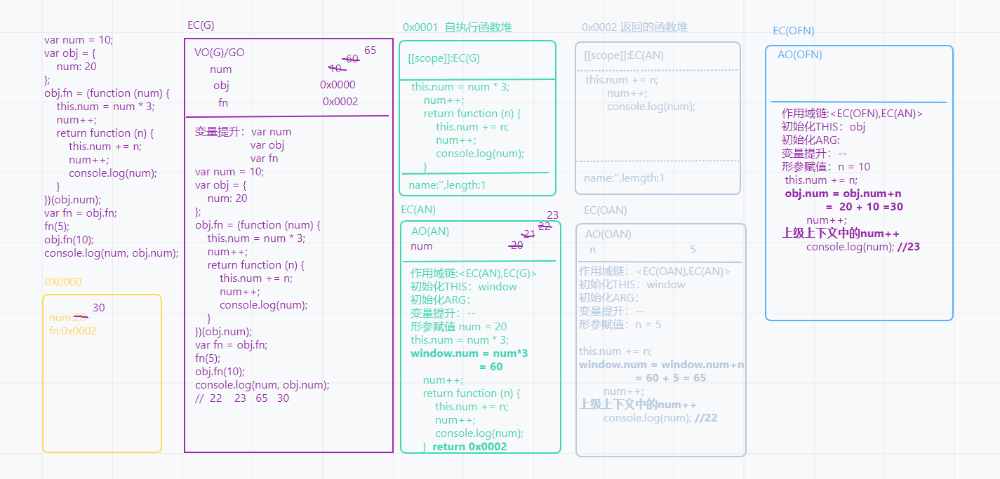
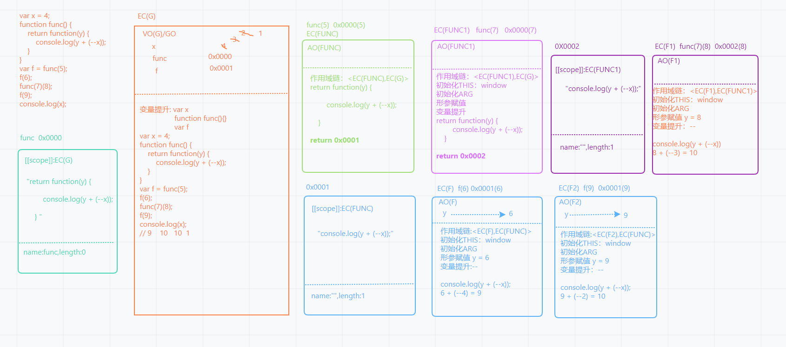

## 1. ECMAScript262中数据类型的标准定义

> **4.2 ECMAScript Overview**
> ECMAScript is object-based: basic language and host facilities are provided by objects, and an ECMAScript program is a cluster of communicating objects. In ECMAScript, an object is a collection of zero or more properties each with attributes that determine how each property can be used—for example, when the Writable attribute for a property is set to false, any attempt by executed ECMAScript code to assign a different value to the property fails. Properties are containers that hold other objects, primitive values, or functions. A primitive value is a member of one of the following built-in types: Undefined, Null, Boolean, Number, String, and Symbol; an object is a member of the built-in type Object; and a function is a callable object. A function that is associated with an object via a property is called a method.
> ECMAScript是基于对象的:基本语言和主机设施是由对象提供的，而ECMAScript程序是通信对象的集群。在ECMAScript中，对象是0个或多个属性的集合，每个属性都具有决定如何使用每个属性的属性——例如，当属性的可写属性被设置为false时，执行ECMAScript代码为属性分配不同值的任何尝试都将失败。属性是容纳其他对象、基本值或函数的容器。原始值是以下内置类型之一的成员:未定义、Null、布尔、数字、字符串和符号;对象是内置类型对象的成员;函数是可调用对象。通过属性与对象关联的函数称为方法。
>
> ECMAScript defines a collection of built-in objects that round out the definition of ECMAScript entities. These built-in objects include the global object; objects that are fundamental to the runtime semantics of the language including Object, Function, Boolean, Symbol, and various Error objects; objects that represent and manipulate numeric values including Math, Number, and Date; the text processing objects String and RegExp; objects that are indexed collections of values including Array and nine different kinds of Typed Arrays whose elements all have a specific numeric data representation; keyed collections including Map and Set objects; objects supporting structured data including the JSON object, ArrayBuffer, and DataView; objects supporting control abstractions including generator functions and Promise objects; and, reflection objects including Proxy and Reflect.
> ECMAScript定义了一个内置对象集合，它完善了ECMAScript实体的定义。这些内置对象包括全局对象;对象是语言运行时语义的基础，包括对象、函数、布尔值、符号和各种错误对象;表示和操作数值(包括数学、数字和日期)的对象;文本处理对象字符串和RegExp;对象，该对象是值的索引集合，包括数组和9种不同类型的数组，其元素都具有特定的数值数据表示;键控集合，包括Map和Set对象;支持结构化数据的对象，包括JSON对象、ArrayBuffer和DataView;支持控制抽象的对象，包括生成器函数和承诺对象;以及反射对象，包括代理和反射
- 原始值类型【值类型/基本数据类型】
  - number 数字
  - string 字符串
  - boolean 布尔
  - null 空对象指针
  - undefined 未定义
  - symbol 唯一值
  - bigint 大数
- 对象类型【引用数据类型】
  - 标准普通对象 object
  - 标准特殊对象 Array RegExp Date Math Error...
  - 非标准特殊对象 Number String Boolean
  - 可调用/执行对象 function
  
## 2. typeof数据类型检测的底层机制
- 特点1: 返回的结果是字符串，字符串中包含了对应的数据类型
  - ```js 
    typeof typeof typeof [1,2,3] //'string' 
    ```
- 特点2：按照计算机底层存储的二进制进行检测【效率高】
  - 000 对象
  - 1 整数
  - 010 浮点数
  - 100 字符串
  - 110 布尔
  - 0000... null
  - -2^30 undefined
  - ...
- 特点3：typeof null -> 'object'
- 特点4：typeof '对象' -> 'object' typeof '函数/class' -> 'function'
  
  - 验证是否是对象的判断
- 特点5：typeof '未被声明的变量' -> 'undefined'
  - 插件封装中的暴露API
  - ```js
     /*  数据类型检测
      *  1.typeof  **
      *  2.instanceof
      *  3.constructor
      *  4.Object.prototype.toString.call([value])  **
      *  ---
      *  Array.isArray
      *  isNaN
      *  ...
      * 
      * typeof底层处理机制
      */
      // 插件封装中暴露API
      // (function () {
      //     let utils = {
      //     };
      //     if (typeof window !== "undefined") window.utils = utils;
      //     if (typeof module === "object" && typeof module.exports === "object") module.exports = utils;
      // })();
      // utils.xxx();
     ```
## 3. JS底层存储机制:堆(Heap)、栈(Stack)内存
- 以下代码作为运行示例
```js
var a = 12;        //window.a = 13
var b = a;         
b = 13; 

console.log(a) 12


let b = 14
const c = 15
d = 16           //window.d = 16
```


- 以下代码作为运行示例
```js
var a = {
    n: 1
};

var b = a;

a.x = a = {
    n: 2
};

console.log(a.x);    // undefined    

console.log(b);      //  { n:1,x:{ n:2 } }

```


## 4. 数据类型解读之 number、Symobol、BigInt
### 4.1 数字类型 number
- 整数、浮点数(小数)、正数、负数、零
- NaN: not a number 不是一个有效数字，但是它率属于number类型
  - `typeof NaN => 'number'`
  - 出现场景：经常出现在，把其他类型转换为数字的时候，如果无法转换为有效数字，结果就是NaN
  - NaN !== NaN NaN和任何值（包括自己本身），都不相等
  - isNaN([val]):检测val是否“不是个有效数字”，如果不是 返回true, 如果是有效数字，返回false. 如果val不是数字类型的，浏览器首先会将其隐式转换为number类型，然后进行检测.
  - Object.is(NaN, NaN) -> true ES6中提供的方法，不兼容IE浏览器
  - ```js
    //let n = ?
    //if (n === NaN) {
    //  条件永远无法成立
    //  console.log('n不是有效数字')
    //}
    let n = ?;
    if(isNaN(n)){
      console.log('n不是有效数字')
    }
    ```
- Infinity 无穷大的值
### 4.2 Bigint
- Bigint 大数
  - JS中最大/最小的安全数字：`Number.MAX_SAFE_INTEGER / Number.MIN_SAFE_INTEGER/Math.pow(2,53) - 1`
  - `9007199254740991 -9007199254740991 16位`
  - 超过这个范围的值进行数字运算，结果是不准确的
  - 场景 服务器端存储的ID是一个很大的值【数据库我们可以基于longInt处理】，现在我们把这个值返回给客户端，客户端获取值之后，需要进行运算处理，如果超过安全数字，导致结果是不准确的.
  ```js
  Number.MAX_SAFE_INTEGER
  9007199254740991
  9007199254740991 + 10
  9007199254741000
  9007199254740991n + 10n
  9007199254741001n
  typeof 9007199254741001n
  "bigint"
  Bigint("90071992547409919007199254740991") -> 90071992547409919007199254740991n
  //一个数字后面加“n”就是BigInt
  //计算完成的超长结果，基于toString转换为字符串【会去掉n】,把这个值再传递给服务器即可
  ```
### 4.3 Symbol
- Symbol唯一值类型
  - `Symbol() //创造一个唯一值
     Symnol('xxx') //创造一个唯一值，只不过设置了标记
    `
  - `new Symbol() Uncaught TypeError: Symbol is not a constructor //不允许被new执行`  
  - 用途1: 给对象设置一个唯一的属性【对象的成员只能是string & symbol 类型的值，Map允许属性名是不同类型的（包含对象）】
  - 用途2：它是很多内置机制的实现方式
    - `Symbol.toPrimitive`
    - `Symbol.hasInstance`
    - `Symbol.toStringTag`
    - ...
  - ```js
    console.log(Symbol('AA') === Symbol('AA')); //false 创造了两个唯一值
    let sy = Symbol('AA')
        ys = sy
    sonsole.log(ys === sy) //true 只创建了一个唯一值
    let key = Symbol('KEY')
    let obj = {
        //属性名：'name' 'age' '0' '1' Symbol() Symbol('KEY') '[object Object]'
        name:'zs',
        age:23,
        0:100,
        1:220,
        [Symbol()]:300,
        [key]:400,
        //把对象转换为字符串，去充当它的属性名
        [{
          name:'xxxx'
        }]:500
    }
    console.log(obj[Symbol()]) //undefined 用新创建的唯一值去获取，肯定获取不到
    console.log(obj[key]);//400
    console.log(obj[0]);//100 -> obj['0']
    ```
## 5. 数据类型转换
### 5.1 把其他数据类型转换为number
- `Number([val])`
  - 一般用于浏览器的隐式转换中
  - 规则：
  1. 把字符串转换为数字：空字符串变为0，如果出现任何一个非有效数字字符，结果都是NaN
  2. 把布尔值转换为数字 true -> 1 false -> 0
  3. null -> 0 undefined -> NaN
  4. Symbol无法转化为数字，会报错：Uncaught TypeError: Cannot convert a Symbol value to a number
  5. Bigint去除n（超过安全数字的，会按照科学计数法处理）
  6. 把对象转换为数字
    - 先调用对象的Symbol.toPrimitive这个方法，如果不存在这个方法
    - 再调用对象的valueOf获取原始值，如果获取的值不是原始值
    - 再调用对象的toString把其变为字符串
    - 最后再把字符串基于Number方法转换为数字
- parseInt([val],[radix])
- parseFloat([val])
  - 一般用于手动转换
  - 规则：[val]值必须是一个字符串，如果不是则先转换为字符串；然后从字符串左侧第一个字符开始找，把找到的有效数字字符最后转换为数字【一个都没找到就是NaN】;遇到一个非有效数字字符，不论后面是否还有有效数字字符，都不再查找了；parseFloat可以多识别一个小数点   
```js
let arr = [27.2, 0, '0013', '14px', 123]
arr = arr.map(parseInt)
/*
parseInt(27.2，0)
  // 27.2 ->  '272.2' -> '27'  -> 把 '27' 看做10进制，转换为10进制 => 27
parseInt(0,1) => NaN

parseInt('0013', 2) 
  // '0013' -> '001' ->把'001'看做2进制，转换为10进制 => 1
  0*2^2 + 0*2^1 + 1*2^0 = 1
parseInt('14px', 3)
  // '14px' -> '1' -> 把'1'看做是3进制，转换为10进制 => 1
  1 * 3^0
parseInt('123', 4)
  // '123' -> 把'123'看做是4进制，转换为10进制 =>27 
  1*4^2  2*4^1  3*4^0  
parseInt传递的第二个值是一个radix进制
  + radix不写或者写0，默认是10进制【如果第一个传递的字符串是以‘0x’开始的,那么默认是16进制】
  + radix取值范围：2~36，不在这个范围内，处理的结果都是NaN
  + 在传递的字符串中.从左到右，找到符合radix进制的值(遇到不符合的则结束查找），把找到的值，看做radix进制，最后转化为10进制
  + 把其它进制的值转换为10进制：‘按权展开求和’
*/
console.log(arr) // [27, NaN, 1, 1, 27]
```
### 5.2 把其它类型转换为布尔
- 除了0/NaN/空字符串/null/undefined五个值是false,其余都是true
### 5.3 把其它类型转换为string
- `[val].toString() & String([val])`
  - 原始值类型：基于引号包起来，bigint会去掉n
  - 对象类型的值：
    - 调用Symbol.toPrimitive
    - 如果不存在则继续调用valueOf获取原始值,有原始值则把其转换为字符串
    - 如果不是原始值，则调用toString转换为字符串
    - 特殊：普通对象转换为字符串是'[object Object]' -> Object.prototype.toString  
- "+"代表的字符串拼接
  - 有两边，一边是字符串,则会变为字符串拼接
  - 有两边， 一边是对象，按照Symbol.toPrimitive -> valueOf ->toString  处理，变为字符串后，就直接按照字符串拼接处理了
    
    - 特殊情况：`{} + 10` -> 10 {}会被认为是代码块，处理的只是+10这个操作
  - +只出现在左边 eg: +[val] 这是把val转换为数字   ++i(先累加在运算) & i++(先运算再累加)
  - ```js
    let result = 100 + true + 21.2 + null + undefined + 'Tencent' + [] + null + 9 + false;
    // 100 + true + 21.2 + null  122.2
    // 122.2 + undefined  NaN
    //  NaN + 'Tencent'   'NaNTencent' 
    //  'NaNTencent' + [] + null + 9 + false  'NaNTencentnull9false'
    console.log(result) //'NaNTencentnull9false'
    ```
### 5.4 '=='比较的时候相互转换的规则
- '==' 相等，两边数据类型不同，需要转换为相同类型，然后进行比较
  - 对象 == 字符串 对象转换为字符串 Symobol.toPrimitive -> valueOf -> toString
  - null == undefined -> true null/undefined和其他任何值都不相等
  null === undefined -> false
  - 对象 == 对象 比较的是堆内存地址，地址相同则相等
  - NaN !== NaN
  - 除了以上情况，只要两边类型不一致，剩下的都是转换为数字，然后再进行比较
- '==='绝对相等，如果两边的类型不同，则直接是false,不会转换数据类型
```js
obj[Symbol.toPrimitive] = function(hint) {
  // hint:number / string /default 浏览器自己调用这个方法的时候 会默认的实参值
}

console.log([] == false); //true
//[] -> Symbol.toPrimitive()/undefined  valueOf()/[]  toString/'' -> 0
// false -> 0  0 == 0 true
var a = ?
if (a == 1 && a == 2 && a == 3){
  console.log('ok')
}
/*
'=='比较：数据类型转换的机制，需要把a转换为数字
因为把对象转换为数字，我们可以做的事很多 Symbol.toPrimitive -> valueOf -> toString -> Number

var a = {
  i:0,
  //还可以重写valueOf和toString
  [Symbol.toPrimitive](){
    return ++this.i
  }
} 
---------
var a = [1, 2, 3]
a.toString = a.shift

全局上下文中
基于var声明的变量是给GO（window）设置的一个属性
获取属性a的值：Object.defineProperty进行数据劫持
var i = 0
Object.defineProperty(window, 'a', {
  get(){
    return ++i
  }
})
*/
```
## 6. JS'骚'操作之0.1 + 0.2 !== 0.3
- 十进制转换为二进制的计算 [val].toString(2)   // 参数是进制 范围 2~36
  - 整数部分 除二取余
  - 小数部分 乘二取整
- JS使用number类型表示数字（整数和浮点数），遵循IEEE-754 标准 通过64位二进制值来表示一个数字`https://babbage.cs.qc.cuny.eduIEEE-754.old/Decimal.html`
  - 第0位：符号位，0表示正数，1表示负数 S
    第1位到第11位「11位指数」：储存指数部分 E
    第12位到第63位「52位尾数」：储存小数部分（即有效数字）F
    注：尾数部分在规约形式下第一位默认为1（省略不写）
- 最大安全数字「16位」 Number.MAX_SAFE_INTEGER === Math.pow(2,53)-1
- 怎么解决精度问题？
  - 将数字转成整数【扩大系数】
  - 第三方库：Math.js、 decimal.js、 big.js
面试题：自己编写程序，把十进制的'整数'转换为二进制
```js
// decimal十进制数
// binary 二进制
// negative 负数
// integer整数
const decimal2binary = function decimal2binary(decimal){
  let binary = [],
      negative = decimal < 0,
      integer;
  decimal = Math.abs(decimal)
  integer = Math.floor(decimal / 2)
  binary.unshift(decimal % 2)
  while(integer){
     binary.unshift(decimal % 2)
     integer = Math.floor(decimal / 2)
  }
  return `${negative?'-':''}${binary.join('')}`     
}
// 浮点数在计算机底层存储的时候，存储的二进制值可能被舍掉一部分【因为最多只有64位】，所以本身和原来的十进制就不一样了“精准度问题”
// '0011111110111001100110011001100110011001100110011001100110011010'  0.1
// '0011111111001001100110011001100110011001100110011001100110011010'  0.2
//  0.1 + 0.2 计算机底层会根据其二进制进行处理，最后转换为十进制给浏览器，这样也是一个很长的值 例如：可能是这样的 0.3000000000000400000000... 但是浏览器也会存在长度的限制，会截掉一部分；最后面全是零的省略掉...

// 解决方案：乘以一定的系数，变为整数进行运算，运算的结果再除以系数
// console.log(((0.1 * 10) + (0.2 * 10)) / 10 === 0.3); //=>true
// 获取系数
const coefficient = function coefficient(num){
  num = num + ''
  let [, char = ''] = num.split('.'),
      len = char.length;
  return Math.pow(10, len)
}
// 求和操作
const plus = function plus(num1, num2){
  num1 = +num1
  num2 = +num2
  if(isNaN(num1) || isNaN(num2)) return NaN
  let coeffic = Math.max(coefficient(num1),coefficient(num2))
  return (num1 * coeffic + num2 * coeffic) / coeffic 
}
```
## 7. 函数底层运行机制
- 以下代码作为运行示例
```js
var x = [12, 23];

function fn(y) {
    y[0] = 100;
    y = [100];
    y[1] = 200;
    console.log(y);
}

fn(x);
console.log(x);
```

## 8.关于this指向的题目分析
+ 1. 给元素的某个事件行为绑定方法【DOM0 & DOM2】，当事件行为触发，方法执行，方法中的this是当前元素本身
```js
box.onclick = function(){}; //DOM0
box.addEventListener('click',function(){}) //DOM2

// IE 6~8
box.attachEvent('onclick',function(){}) //方法执行里面的this是window
```
+ 2. 函数执行，看前面是否有点'.'
  - @1 有点 '.'前面是谁，this就是谁
  - @2 没有点 方法中的this是window（非严格模式）/undefined(严格模式)
+ 3. 箭头函数中没有自己的this，箭头函数执行,没有初始化this这个步骤，用到的this都是其上级上下文中的this
+ 4.废话少说直接上题目
- 以下代码作为运行示例
```js
var x = 3, 
    obj = { 
        x:5 
    }; 
obj.fn = (function(){ 
    this.x *= ++x; 
    return function (y) { 
        this.x *= (++x) + y; 
        console.log(x); 
    } 
})() 
 
var fn = obj.fn; 
obj.fn(6) 
fn(4) 
console.log(obj.x, x)
```

- 以下代码作为运行示例
```js
var num = 10;
var obj = {
    num: 20
};
obj.fn = (function (num) {
    this.num = num * 3;
    num++;
    return function (n) {
        this.num += n;
        num++;
        console.log(num);
    }
})(obj.num);
var fn = obj.fn;
fn(5);
obj.fn(10);
console.log(num, obj.num);
```

- 分析以下代码
```js
let obj = {
    fn: (function () {
        return function () {
            console.log(this);
        }
    })() //obj.fn = function (){console.log(this)}把自执行函数执行的结果‘小函数’ 赋值给obj.fn
};
obj.fn(); // obj 
let fn = obj.fn;
fn(); //window
```
- 分析以下代码
```js
var fullName = 'language';
var obj = {
    fullName: 'javascript',
    prop: {
        getFullName: function () {
            return this.fullName;
        }
    }
};
console.log(obj.prop.getFullName()); //this -> obj.prop    obj.prop.fullName => undefined
var test = obj.prop.getFullName;
console.log(test()); //this -> window  window.fullName => 'language'
```
- 分析以下代码
```js
var name = 'window';
var Tom = {
    name: "Tom",
    show: function () {
        console.log(this.name);
    },
    wait: function () {
        var fun = this.show;
        fun();
    }
};
Tom.wait();
//this -> Tom  fun = Tom.show()  fun() this -> window 'window'
```
- 分析以下代码
```js
window.val = 1;
var json = {
    val: 10,
    dbl: function () {
        this.val *= 2;
    }
}
json.dbl();
// this -> json   json.val = json.val * 2 = 10 * 2 = 20
var dbl = json.dbl;
dbl();
// this -> window  window.val = window.val * 2 = 1 * 2 = 2
json.dbl.call(window);
// this -> window  window.val = window.val * 2 = 2 * 2 = 4
alert(window.val + json.val);
// 4 + 20 => // '24'
```
- 分析以下代码
```js
(function () {
    var val = 1;
    var json = {
        val: 10,
        dbl: function () {
            val = val * 2; 
        }
    };
    json.dbl();
    // this -> json  val = 1 * 2 = 2 上级上下文 中的val
    alert(json.val + val); // 10 + 2 = 12  => '12'
})();
```
## 9.关于闭包的分析
- 废话少说直接上题目
- 1.以下代码作为运行示例
```js
let x = 5;
function fn(x) {
    return function (y) {
        console.log(y + (++x));
    }
}
let f = fn(6);
f(7);
fn(8)(9);
f(10);
console.log(x); 
```

- 2. 以下代码作为运行示例
```js
let a = 0,
    b = 0;
function A(a) {
    A = function (b) {
        alert(a + b++);
    };
    alert(a++);
}
A(1);
A(2);
```

## 10.关于let、const、var的区别
- 1. let VS var
  - @1 var存在变量提升,而let不存在变量提升
  ```js
  console.log(x) //undefined
  console.log(y) //Uncaught ReferenceError: Cannot access 'y' before initialization
  var x = 12
  let y = 13
  // const fn = function () {}; //函数表达式（没有变量提升，只能在创建函数以下使用）；用const声明，后期不允许重构fn；「推荐」
  ```
  - @2 全局上下文基于var声明的变量是直接存储到GO中的(window),而let是存储到VO(G)中的，和GO没关系
  ```js
  var x = 12;
  let y = 13;
  console.log(x,y); //12 13
  console.log(window.x, window.y)//12 undefined
  ```
  - @3 var允许重复声明（只不过浏览器只声明一次而已，但是词法上是允许的）；但是let在词法上，都不允许重复声明[错误发生在"词法解析阶段"]，并且不论我们基于何种方式声明过这个变量（例如：var/function再或者是一个形参...）再基于let/const声明都会报错
  ```js
  var x = 12
  var x = 13
  console.log(x); //13
  let x = 15  //Uncaught SyntaxError: Identifier 'x' has already been declared
  ```
  - @4 在JS代码执行的过程中，如果大括号（排除对象和函数）中出现let/const/function/class等关键词（切记：没有var）,则大括号所在的代码块,会产生一个“私有块级上下文”！！ var不会产生块级上下文，而且块级上下文对他也没有任何的作用！！
  ```js
  console.log(a) //undefined
  console.log(b)//Uncaught ReferenceError: Cannot access 'b' before initialization
  var a = 12
  let b = 13
  if(1 == 1){
    /*
    EC(BLOCK) 块级私有上下文
    VO(BLOCK) 私有变量对象
      b ----> 200
      a ----> 100
    作用域链:<EC(BLOCK),EC(G)> 上级上下文：是看在哪执行代码产生的块级上下文
    初始化THIS 没有这一步 块级上下文中没有自己的THIS 用到的THIS都是上级上下文中的
    初始化ARG 没有这一步
    形参赋值 没有这一步
    变脸提升 var a
    代码执行
    */
    console.log(a) //12
    console.log(b) //Uncaught ReferenceError: Cannot access 'b' before initialization
    var a = 100
    let b = 200
    console.log(a) //100
    console.log(b) //200
  }
  console.log(a) //100
  console.log(b) //13
  ```
  - @5 暂时性死区
  ```js
  console.log(x); //Uncaught ReferenceError: x is not defined 使用未被声明的变量，结果应该是报错的
  console.log(typeof x); //“undefined” 基于typeof检测一个未被声明的变量，结果是“undefined”，而不会报错!!
  ```


  //-------------------------------------------------------
  console.log(typeof x); //Uncaught ReferenceError: Cannot access 'x' before initialization
  let x = 12; //使用let 声明后在声明之前使用是会报错的
  ```
- 2. let VS const
  - let 和 const 声明的都是变量，都是要存储到当前上下文的VO/AO变量对象中的
  - @1 let声明的变量，后续根据需求，可以改变‘变量’和‘值’之间的指针指向；而const不允许改变“变量”的指针指向；
  ```js
  let a = 12
  a = 13
  console.log(a) //13

  const a = 12
  a = 13; // Uncaught TypeError: Assignment to constant variable..
  const obj = {
    name: 'zhufeng'
  };
  obj.name = 'peixun';
  console.log(obj); //{name:'peixun'}
  ```
  - @2 const 声明的变量必须要有初始值
  ```js
  let n
  console.log(n) //undefined
  const m ; //Uncaught SyntaxError: Missing initializer in const declaration
  ```
## 11. 关于变量提升的分析
- 1.
```js
/*
  EC(G)
     a -----> 1
     fn ----> 0x0000 [[scope]]:EC(G)   
  变量提升: var a
            function fn(){}  
*/
var a = 1;
function fn(a) {
    /*
      EC(FN)
      AO(FN) a ----> 1
               ----> 0x0001  [[scope]]:EC(FN)
               ----> 2
      作用域链:<EC(FN),EC(G)>
      初始化THIS:WINDOW
      初始化ARG：{0:1,length:1}
      变量提升：var a; function a(){}
      形参赋值 a = 1
      代码执行
    */
    console.log(a); // function a(){}
    var a = 2;
    function a() {}
    console.log(a); //2
}
fn(a); 
console.log(a); //1 
```
- 2.
```js
/*
EC(G)
变量提升：var a 
          function fn(){}  [[scope]]:EC(G) 0X0001

*/
console.log(a); //=>undefined
var a=12; 
function fn(){
  /*
  EC(FN)

  AO(FN) a ---> 13
  作用域链:<EC(FN),EC(G)>
  变量提升: a 
  */
    console.log(a); //=>undefined
    var a=13;   
}
fn();   
console.log(a); //=>12 
```
- 3.
```js
/*
EC(G)
VO(G)    a ---> 12
           ---> 13   
变量提升 a 
        fn ---> 0x0000 [[scope]]:EC(G)
*/
console.log(a); //=>undefined
var a=12;
function fn(){
    /*

    EC(FN)

    AO(FN)

    作用域链 <EC(FN),EC(G)>

    */
    console.log(a); //=>12
    a=13;
}
fn();
console.log(a); // 13
```
- 4.
```js
/*
EC(G)

VO(G)   fn --=>  0x0000 [[scope]]:EC(G)
变量提升  function fn() {}  0x0000 [[scope]]:EC(G)
*/
console.log(a); //=>报错 Uncaught ReferenceError: a is not defined
a=12;
function fn(){
    console.log(a);
    a=13;   
}
fn();
console.log(a); 
```
- 5.
```js
/*
EC(G)

VO(G) foo ---> 'hello'

*/
var foo = 'hello';
(function (foo) {
    /*
    自执行函数执行和创建 一起执行
    EC(AN)

    AO(AN)
    作用域链<EC(AN),EC(G)>
    形参赋值：foo = 'hello'
    变量提升:var foo

    */    
    console.log(foo); //=>'hello'
    var foo = foo || 'world';
    console.log(foo); //=>'hello'
})(foo); //(function(foo){...})('hello')
console.log(foo); //=>'hello'
```
- 6. 函数是个渣男

```js
console.log(foo); //undefined
{
    console.log(foo); //函数
    function foo() {}
    console.log(foo); //函数
    foo = 1;
    console.log(foo); //1
}
console.log(foo); //函数 
```


```js
console.log(foo); //undefined
{
    console.log(foo); // 函数 2
    function foo() {1} //将这行代码之前对foo的操作 给 全局 foo 同步为 函数2
    console.log(foo)  // 函数2
    foo = 1;
    console.log(foo); // 1
    function foo() {2} // 将这行代码之前对foo的操作 给 全局foo同步一份  foo = 1
    console.log(foo);  // 1
}
console.log(foo); // 1
```

```js
console.log(foo) //undefined
{
    function foo() {} // 将这行代码之前对foo 做的操作 同步一份给全局的foo  foo => 函数 foo
    foo = 1; 
    function foo() {} // 将这行代码之前对foo 做的操作 同步一份给全局的foo  foo => 1
    foo = 2;
}
console.log(foo); // 1
```
- 7. 函数形参赋值默认值
```js

var x = 1;
function func(x, y = function(){x = 2}){
    
    var x = 3; 
    y(); 
    console.log(x); 
}
func(5);
console.log(x); 
```


```js
/*
EC(G)


VO(G)/GO
          x ---> 1
          func ---> 0x0000 [[scope]]:EC(G)
               
变量提升：var x;   function func(x, y=...){}
*/
var x = 1;
/*
EC(FUNC)    
    x --> 2
    y ---> 0x0001 [[scope]]:EC(FUNC)
    作用域链:<EC(FUNC),EC(G)>
    形参赋值： x=5 y=小函数（形参默认值）
    变量提升：---
*/ 
function func(x, y = function(){x = 2}){
    /*
    EC(B)
    VO(B)
      作用域链<EC(B),EC(FUNC)>
      x = 3 x不是块级上下文中的 向上查找修改 func中的 x 为 3
    */
    x = 3; 
    y(); //调用y 修改修改 func中的 x 为 2
    console.log(x); // 2
}
func(5);
console.log(x);//1


```
## 12. 关于闭包作用域的分析
- 1. ARG和形参的映射机制「非严格模式」
```js
/*
EC(G)

VO(G)
   a ----> 4
     ----> undefined
   b ----> 0x0000 [[scope]]:EC(G)
变量提升：
   var a
   function b(x, y, z) {...}
*/
var a = 4;
function b(x, y, a) {
    "use strict";
    /*
    EC(B)
     
    AO(B)
      x -->
    作用域链:<EC(B),EC(G)>
    初始化ARG：{0:1, 1:2, 2:3(10), length:3} 类数组集合，实参集合
    形参赋值： x=1 y=2 a=3
        特殊性 在非严格模式下，初始化ARG和形参赋值后，会建立一个映射机制：但是在严格模式下是不存在的
    变量提升：--
    */
    console.log(a); //=>3
    arguments[2] = 10;
    console.log(a); //=>10 严格模式下还是3
}
a = b(1, 2, 3);
console.log(a); // undefined
```
- 2. 
```js
/*
EC(G)

VO(G)
 test ---> 0x0001 [[scope:EC(G)]]
变量提升：var test
*/
var test = (function (i) {
    /*
    自执行函数执行EC(AN)
     i--->2
    作用域链 <EC(AN),EC(G)>
    形参赋值：i --> 2
    变量提升
    */
    return function () {
       /*
       EC(AN)

       AO(AN)
       
       作用域链<EC(TEST),EC(AN)>
       初始化ARG:{0:5,length:1}
       形参赋值：--
       变量提升：--
       */
        
        alert(i *= 2); //i=i*2 =>"4"
    } // return 0x0002 [[scope]]:EC(AN)
})(2);
test(5); 
```
- 3. 
```js
var x = 4;
function func() {
    return function(y) {
        console.log(y + (--x));
    }
}
var f = func(5);
f(6);
func(7)(8);
f(9);
console.log(x);
```

- 5.
```js
var x = 5,
    y = 6;
function func() {
    x += y;
    func = function (y) {
        console.log(y + (--x));
    };
    console.log(x, y);
}
func(4);
func(3);
console.log(x, y);
```

- 6.
```js
function fun(n, o) {
    console.log(o);
    return {
        fun: function (m) {
            return fun(m, n);
        }
    };
}
var c = fun(0).fun(1);
c.fun(2);
c.fun(3);
```

## 13. 闭包应用：循环中闭包的处理方案
- 循环事件绑定
```js
    
  var btnList = document.querySelectorAll('.btn');
  for (var i = 0; i < btnList.length; i++) {
      btnList[i].onclick = function () {
          console.log(`当前点击按钮的索引：${i}`);
      };
  }
  // 无法实现？ 每次点击按钮，执行对应的方法，方法中的i不是私有的，而是全局的，而此时全局的i已经是循环结束的5了 
```

  - 自定义属性
  ```js
  let btnList = document.querySelectorAll('.btn');
  let i = 0;
  for (; i < btnList.length; i++) {
      // 最开始每轮循环的时候，给每一个按钮对象都设定一个自定义属性myIndex，存储它的索引
      btnList[i].myIndex = i;
      btnList[i].onclick = function () {
          // 每一次点击的时候，基于THIS(当前操作元素)获取之前存放的自定义属性值
          console.log(`当前点击按钮的索引：${this.myIndex}`);
      };
  }
  //性能比闭包要好一些,但是也有一些性能消耗(元素对象 & 节点集合 & 绑定的方法 都是开辟的堆内存)
  ```
  - 闭包的N中方案【含let处理机制】
  ```js
  //解决办法一：闭包解决方案，利用闭包的“保存机制”
  //每轮循环的时候,都创建一个闭包(不释放的上下文),闭包中存储自己的私有变量i,并且值是每一轮循环的索引;当点击按钮,执行对应的函数,遇到一个变量i,不要再去全局找了,而是让其去所属的闭包中查找即可...
  
  //@1
  var btnList = document.querySelectorAll('.btn');
  for (var i = 0; i < btnList.length; i++) {
    //循环五次,产生五个不释放的闭包,每一个闭包中,都存在一个私有变量i,变量的值是对应的索引
      function(i){
        btnList[i].onclick = function () {
          console.log(`当前点击按钮的索引：${i}`);
        };
      }(i)
  } 

  //@2
  var btnList = document.querySelectorAll('.btn');
  for (var i = 0; i < btnList.length; i++) {
    //循环五次,产生五个不释放的闭包,每一个闭包中,都存在一个私有变量i,变量的值是对应的索引
      
        btnList[i].onclick = function (i) {
          return function(){
              console.log(`当前点击按钮的索引：${i}`);
          }
        }(i)
  } 

  //@3 NodeList集合本身具备forEach方法,和数组中的类似,都是用来迭代集合中每一项
  var btnList = document.querySelectorAll('.btn');
  btnList.forEach(function (item, index) {
      // 迭代集合中每一项，都把这个回调函数执行，产生一个闭包「因为上下文中创建的小函数，被外层的按钮对象的onclick占用了；每个闭包中有一个私有变量index，存储的是当前这一项的索引」
      item.onclick = function () {
          console.log(`当前点击按钮的索引：${index}`);
      };
  });
  //@4 let也是基于闭包的方案,只不过利用的是LET会产生块级上下文
  let btnList = document.querySelectorAll('.btn');
  for (let i = 0; i < btnList.length; i++) {
      // 每一轮循环都产生一个私有的块级上下文，里面的内容(函数)被外部占用，也会产生一个闭包；而且每个闭包中，都有一个私有变量i记录索引
      btnList[i].onclick = function () {
          console.log(`当前点击按钮的索引：${i}`);
      };
  }

  //这样操作i也是全局的,也不会产生块级上下文
  let i = 5;
  for (; i < 5; i++) {
    i++
  }
  //闭包方案虽然可以解决,但是比较消耗内存
  ```

  - 事件委托
  ```js
  //终极方案 事件委托
  //点击每一个按钮,除了触发按钮的点击事件行为,根据冒泡传播机制,也会把body的点击事件行为触发
  document.body.onclick = function (ev) {
    let target = ev.target;
    if (target.tagName === 'BUTTON' && target.className === "btn") {
        // 点击的事件源是按钮
        let index = target.getAttribute('data-index');
        console.log(`当前点击按钮的索引：${index}`);
    }
  };
  ```
- 循环中的定时器
```js
// 能否实现每间隔一秒输出 0 1 2?
for (var i = 0; i < 3; i++) {
    setTimeout(function () {
        console.log(i);
    }, i * 1000); //等待时间 0ms(5~7ms)  1000ms  2000ms
}
//现在效果是,每间隔1000ms都输出的是3?定时器执行,方法中的i不是私有的,向上级查找就是全局的i[此时全局i已经是循环结束的3]

// @1 
for (let i = 0; i < 3; i++) {
    setTimeout(function () {
        console.log(i);
    }, i * 1000);
} 

//@2 
let i = 0;
for (; i < 3; i++) {
    (function (i) {
        setTimeout(function () {
            console.log(i);
        }, i * 1000);
    })(i);
}

//@3
const fn = i => {
    return function () {
        console.log(i);
    };
};
let i = 0;
for (; i < 3; i++) {
    setTimeout(fn(i), i * 1000);
}

//@4
let i = 0;
for (; i < 3; i++) {
    // 设置定时器：
    //   参数1：回调函数，到时间执行的方案
    //   参数2：等待时间
    //   参数3：给回调函数“预先传递”的实参值{底层本质也是闭包 柯理化函数思想}
    setTimeout(function (n) {
        console.log(n);
    }, i * 1000, i);
}
```
## 13. 闭包进阶之:柯里化函数
- 迭代方法:`forEach map reduce reduceRight find findIndex filter some exery... MDN`
- `reduce`数组的迭代方法,它支持结果的累积,因为在下一轮迭代可以拿到上一轮迭代的返回结果
```js
let arr = [1, 2, 3, 4]
let total = arr.reduce((result, item, index) => {
  // 数组从第二项开始迭代
  // 第一轮 result数组第一项1 item数组第二项2 index是第二项的索引1
  // 第二轮 result存储的是上一轮返回的结果3  item=3 index=2
  // 第三轮 result=6 item=4 index=3 

  return result + item
})

let total = arr.reduce((result, item) => {
  // 传递的第二项是给result设置的初始值   item从数组的第一项开始迭代
  return result + item 
},0)
```
- 柯里化函数思想
> 预先存储(预处理),利用闭包的"保存机制",我们把一些值事先存储起来,供其下级上下文中后期使用.
```js
const fn = (...params) => {
  return (...arg) => {
    params = params.concat(arg)
    return params.reduce((result, item) => result + item)
  }
}
let res = f(1,2)(3)
console.log(res) //6   1+2+3=6
```
> 基于console.log或alert输出一个函数:会默认先把函数转化为了字符串[Symbol.toPrimitive -> valueOf -> toString],然后再输出[只不过浏览器为了让开发者知道这是个函数字符串,所以在输出的字符串前面,加了一个"f"]
```js
const fn = function(){
  // ...
}
fn[Symbol.toPrimitive] = function () {
  console.log('ok')
  return 'zhufeng'
}
console.log(fn)

// 函数柯里化后的求和
const curring = function curring(){
  let params = []
  const add = (...args) => {
    params = params.concat(args)
    return add
  }
  add[Symbol.toPrimitive] = () => params.reduce((result, item) => result + item)
  return add
}

let add = curring()

let res = add(1)(2)(3)

console.log(res) // 6
```
- lodash中的柯里化函数
  - 功能:创建一个函数,该函数接受一个或者多个func的参数,如果func所需要的参数都被提供则执行func并返回执行的结果.否则继续返回该函数并等待接收剩余的参数.
  - 参数: 需要柯里化的函数
  - 返回值: 柯里化后的函数
  ```js
  const _ = require('lodash')

  function getSum(a, b, c){
    return a + b + c
  }
  const curried = _.curry(getSum)
  let curried1 = curried(1, 2)
  console.log(curried1(7))
  ```
  - 原理实现
  ```js
  function curry (func){
    return function curriedFn(...args){
      //判断传入的参数 与传入的函数的形参个数是否相同
      if(args.lenght < func.length){
        return function(){
          return curriedFn(...args,...arguments)
        }
      }
      return func(...args)
    }
  }
  ```
- 函数组合及其实现
```js
// 在函数式编程当中有一个很重要的概念就是函数组合， 实际上就是把处理数据的函数像管道一样连接起来， 然后让数据穿过管道得到最终的结果。 例如：
    const add1 = (x) => x + 1;
    const mul3 = (x) => x * 3;
    const div2 = (x) => x / 2;
    div2(mul3(add1(add1(0)))); //=>3

    // 而这样的写法可读性明显太差了，我们可以构建一个compose函数，它接受任意多个函数作为参数（这些函数都只接受一个参数），然后compose返回的也是一个函数，达到以下的效果：
    const operate = compose(div2, mul3, add1, add1)
    operate(0) //=>相当于div2(mul3(add1(add1(0)))) 
    operate(2) //=>相当于div2(mul3(add1(add1(2))))

    // 简而言之：compose可以把类似于f(g(h(x)))这种写法简化成compose(f, g, h)(x)，请你完成 compose函数的编写 
    const compose = function compose(...funcs){
      let len = funcs.length
      if (len === 0) return x => x
      if (len === 1) return funcs[0]
      return function operate(x){
        return funcs.reduceRight((result, func) => {
          return func(result)
        },x)
      }
    }
    // 课后思考：redux中的compose函数编写思想
    /* function compose(...funcs) {
        if (funcs.length === 0) {
            return (arg) => arg
        }
        if (funcs.length === 1) {
            return funcs[0]
        }
        return funcs.reduce((a, b) => (...args) => a(b(...args)))
    } */
```
## 14. JS高阶编程技巧：惰性思想
```js
// 惰性思想：懒，能够执行一遍的，绝不会执行第二遍[性能优化]
//  - getComputedStyle([Element])[ATTR] 获取当前元素所有经过浏览器计算的样式
//  - [Element].currentStyle[ATTR] IE6-8
let getCss = function getCss(ele, attr) {
    if ('getComputedStyle' in window) {
        return window.getComputedStyle(ele)[attr];
    }
    return ele.currentStyle[attr];
};
console.log(getCss(box, 'width'));
console.log(getCss(box, 'padding'));
console.log(getCss(box, 'display')); 
// 以上代码的弊端 第一次执行，需要校验一下兼容性；但是后续每一次执行，都需要重新校验“这个操作是多余的”...

// 优化
let getCss = function(ele,attr){
  if('getComputedStyle' in window){
    getCss = function(ele,attr){
      return window.getComputedStyle(ele)[attr]
    }
  }else{
    getCss = function (ele, attr) {
      return ele.currentStyle[attr]
    }
  }
  return getCss(ele, attr)
}
console.log(getCss(box, 'width'));
console.log(getCss(box, 'padding'));
console.log(getCss(box, 'display'));
```
## 15. 闭包进阶之:单例设计模式 & 模块化编程思想
模块化编程历史[当代前端开发，都是模块化编程，优点：公用性&复用性、提高开发效率、方便管理、团队协作开发...]
- @1. 高级单例设计模式[闭包+对象] 局限性：根据模块之间的依赖，需要明确导入顺序。
```js
// 闭包的作用：保护
(function () {
    let name = 'foo';
    let age = 85;
    let GF = false;
})();
(function () {
    let name = 'bar';
    let age = 165;
    let GF = true;
})();
// 基于对象进行分组，每一个对象都是Object这个类的实例 --> “单例设计模式”，设计模式都是一种思想，用来解决一个问题：基于单独的实例，来实现信息分组，这样可以避免全局变量的污染
//   + person1/person2 可以被称之为“命名空间”
//   + 把描述同一个事物的属性和方法放在相同的命名空间下
let person1 = {
    name: 'foo',
    age: 81,
    GF: false
};

let person2 = {
    name: 'bar',
    age: 19,
    GF: true
}; 


// 新闻板块
let newsModule = (function () {
    let time = new Date();
    const query = function query() {
        // ...
    };
    const handle = function handle() {
        // ...
    };

    // 把供其它板块调用的方法，暴露到全局对象上「局限：暴露的内容比较多，则还会引发全局变量冲突」
    // window.query = query;

    // 通过 返回一个对象来暴露API
    return {
        // query:query
        query,
        handle
    };
})();

// 皮肤板块
let skinModule = (function () {
    let time = '2021-05-03';
    const handle = function handle() {
        // ...
    };
    newsModule.query();

    return {
        handle
    };
})(); 
```
- @2. AMD 按需加载(require.js) 局限：所有的依赖都是需要提前导入的
  - require.js的用法
  目录结构
  
  - main.js
  ```js
    //全局配置
    require.config({
        baseUrl: 'js/lib',
    });
    
    //导入模块 A B
    require(['moduleB', 'moduleA'], function (moduleB, moduleA) {
        console.log(moduleB.average(10, 20, 30, 40, 50));
    });
  ```
  - moduleA.js
  ```js
    define(function () {
      return {
          // 任意数求和
          sum(...args) {
              let len = args.length,
                  firstItem = args[0];
              if (len === 0) return 0;
              if (len === 1) return firstItem;
              return args.reduce((total, item) => {
                    return total + item;
                });
            }
        };
    });
  ```
  - moduleB.js
  ```js
    define(['moduleA'], function (moudleA) {
      return {
          // 求平均数（去掉最大最小值）
          average(...args) {
              let len = args.length,
                  firstItem = args[0];
              if (len === 0) return 0;
              if (len === 1) return firstItem;
              args.sort((a, b) => a - b);
                args.pop();
                args.shift();
                return (moudleA.sum(...args) / args.length).toFixed(2);
            }
        };
    });
  ```
  - 自己实现一套简易的AMD模块机制
  ```js
    let factories = {}
    function define(moduleName,factory){
      factories[moduleName] = factory
    }
    function require(modules, callback){
      modules = modules.map(function (item) {
        let factory = factories[item]
        return factory()
      })
      callback(...modules);
    }
    /* 使用AMD */
    define('moduleA',function(){
      return {
        fn(){
          console.log('moduleA')
        }
      }
    })
    define('moduleB',function(){
      return{
        fn(){
          console.log('moduleB')
        }
      }
    })
    require(['moduleA','moduleB'], function(moduleA,moduleB){
      moduleB.fn()
      moduleA.fn()
    })
  ```
- @3 CMD(sea.js) & CommonJS规范(Node.js)  问题：客户端浏览器不支持CommonJS规范；当代打包工具webpack是支持CommonJS规范的，最后按照CommonJS把各个模块进行打包，编译为浏览器可以支持的代码「webpack本身是基于node环境运行的，基于webpack打包后的代码，是webpack自己实现了一套CMD规范」！！
- @4 ES6Module模块规范   特点：webpack中也支持、浏览器中也可以直接支持

- JQ部分源码[JQ虽然已经不属于这个时代了，但是其中一些优秀的思想仍然是值得我们学习的。]
```js
var g = typeof window !== "undefined" ? window : this
var factory = function factory(window, noGlobal){
  //webpack: window --> window noGlobal --> true
  //浏览器(webiew): window --> window noGlobal --> undefined
  "use strict" //开启严格模式
  var version = "3.6.0"
      jQuery = function (selector, context){
        return new jQuery.fn.init(selector,context)
      }
      // ======冲突处理
      // 场景
      //    <script src='zepto.js'></script>
      //        window.$=Zepto;
      //    <script src='jquery.js'></script>
      //        var _$=window.$;  // _$===Zepto
      //        jQuery.noConflict = function (deep) {}
      // 
      //        window.$=jQuery;
      // JQ抢了Zepto对$的使用权，此时需要转让使用权 let jj=$.noConflict()，后期 jj 代表的是就是JQ
      var _jQuery = window.jQuery,
          _$ = window.$
      jQuery.noConflict = function(deep){
        if(window.$ === jQuery) {
          window.$ = _$
        }
        if(deep && window.jQuery === jQuery){
          window.jQuery = _jQuery
        }
        return jQuery
      }

      //===============导出API
      // 让其支持AMD模块规范
      if(typeof define === "function" && define.amd){
        define("jQuery",[],function(){

        })
      }
      // 如果直接在浏览器（webview）中基于<script src='jquery.js'> 导入的JQ，我们在全局对象中暴露 “jQuery | $”
      if(typeof noGlobal === "undefined"){
        window.jQuery = window.$ = jQuery
      }
}


(function(global, factory){
  //浏览器(webview & webpack):global --> window
  //Node环境：global --> global/模块
  "use strict"
  if(typeof module === "object" && typeof module.ecports === "object"){
    //当前环境支持CommonJS规范 NODE & webpack
    module.exports = global.document ?
    // global --> window 说明是运行在webpack环境中的
    factory(global, true) :
    // 说明在Node环境下运行"JQ不支持Node环境下运行"
    function(w){
      if(!w.document){
        throw new Error("jQuery requires a window with a document")
      }
       return factory(w);
    }
  } else {
    // 浏览器(webview)
    factory(global);
  }
})(g,factory)
```
## 16. 手撕函数的防抖和节流
- 函数防抖
> (debounce)在用户频繁触发某个行为的时候，我们只识别一次即可[开始边界：第一次点击触发 结束边界：等到最后一次触发]
```js

//<button id="submit" ></button>
let submit = document.querySelector("#submit")

//模拟从服务器获取数据（需要1000ms）
const queryData = callback => {
  setTimeout(function(){
    callback('OK')
  },1000)
}

/*
  debounce:函数防抖
  @params 
    func:自己最终要执行的任务
    wait:多久操作一次算是频繁触发[默认值：500ms]
    immediate:控制触发的边界[默认值：false结束边界  true开始边界]
  @return
    operate处理函数，处理函数会在频繁触发的时候，频繁执行，函数内部，控制我们想要操作的func只执行一次
*/
const clearTimer = function clearTimer(timer){
  if(timer){
    clearTimeout(timer)
  }
  return null
}

const debounce = function debounce(func,wait,immediate){
  if(typeof func !== "function") throw new TypeError('func must be an function!')
  if(typeof wait === "boolean") immediate = wait
  if(typeof wait !== "number") wait = 500
  if(typeof immediate !== "boolean") immediate = false

  let timer = null
  return function operate(...params){
    let now = !timer && immediate
    timer = clearTimer(timer)
    timer = setTimeout(() => {
      timer = clearTimer(timer)
      //结束边界触发
      if(!immediate) func.call(this, ...params)
    },wait)
    //开始边界触发
    if(now)  func.call(this, ...params)
  }
}

submit.onclick=debounce(queryData,false)
```
- 函数节流
> (throttle)在频繁操作的时候，我们能降低触发的频率 (执行的频率自己来设定)
```js
const throttle = function throttle(func,wait){
  if(typeof func !== "function") throw new TypeError('func must be an function')
  if(typeof wait !== "nummber") wait = 500
  let timer = null,
      previous = 0;
  return function operate(...params){
    let now = +new Date(),
        remaining = wait - (now - previous)
    if(remaining <= 0){
      // 两次间隔时间超过500ms了，让其方法立即执行
      timer = clearTimer(timer);
       func.call(this, ...params)
      previous = +new Date()
    }else if(!timer){
      // 没设置过定时器等待，则我们设置一个去等待即可
      timer = setTimeout(() => {
        timer = clearTimer(timer);
        func.call(this, ...params);
        previous = +new Date();
      },remaining)
    }
  }
}
```
## 17. 图片延迟加载的N种实现方案
- 基于JS 盒模型实现的懒加载方案

```html
  <div class="container clearfix">
		<div class="column">
			<!-- <div class="card">
				<a href="#">
					<div class="lazyImageBox">
						
					</div>
					<p>泰勒·斯威夫特（Taylor Swift），1989年12月13日出生于美国宾州，美国歌手、演员。2006年出道，同年发行专辑《泰勒·斯威夫特》，该专辑获得美国唱片业协会的白金唱片认证</p>
				</a>
			</div> -->
		</div>
		<div class="column"></div>
		<div class="column"></div>
	</div>
	<div class="loadingBox"></div>

	<!-- IMPORT JS -->
	<script src="lib/utils.js"></script>
	<script src="index.js"></script>
```
```js
let imageModule = (function(){
  let columns = Array.from(document.querySelectorAll('.column')),lazyImageBoxs
  // 数据绑定
  const bindHTML = function bindHTML(data){
    //计算真实渲染的高度
    data = data.map(item => {
      let w = item.width, h = item.height;
      h = h / ( w/230 )
      item.width = 230
      item.height = h
      return item;
    })

    // 按照三个为一组进行循环（最后一组可能不到三项）
    for(let i=0; i<data.length; i += 3){
      // 把三组数据按照高度排序（升序）
      let group = data.slice(i,i+3);
      group.sort((a,b) => a.height - b.height)

      // 把三个列按照现在的高度进行排序(降序)
      columns.sort((a,b) => b.offsetHeight - a.offsetHeight)

      // 循环三个数据中的每一项：每循环一项，创建一个CARD，把创建的CARD放到对应的列中即可
      group.forEach((item, index) => {
        let {pic, link, title, height,} = item
        let card = document.createElement('div');
        card.className = "card";
                card.innerHTML = `<a href="${link}">
					<div class="lazyImageBox" style="height:${height}px">
						
					</div>
					<p>${title}</p>
        </a>`;
        columns[index].appendChild(card);
      })
    }
    // 获取所有需要延迟加载的盒子
    lazyImageBoxs = Array.from(document.querySelectorAll('.lazyImageBox'));
  }
  // 单张图片加载「为了防止加载的地址有错误，我们都是临时创建一个IMG去加载地址，能加载成功，才把地址赋值给真正的IMG」
  const singleImgLoading = function singleImgLoading(imgBox){
    let img = imgBox.querySelector('img'),
        trueImg = img.getAttribute('data-img'),
        tempImg = new Image();
    tempImg.src = trueImg
    tempImg.onload = function(){
      img.src = trueImg;
      img.style.opacity = 1;
      tempImg = null
    }
    imgBox.isLoad = true;
  }
  // 根据条件规则，控制哪些延迟加载
  const lazyImgsFunc = function lazyImgsFunc () {
    lazyImageBoxs.forEach(imgBox => {
      if(imgBox.isLoad) return //处理过就不在处理

      //方案一
      let A = imgBox.offsetHeight + utils.offset(imgBox).top,
          B = document.documentElement.clientHeight + document.documentElement.scrollTop
          if(A <= B) singleImgLoading(imgBox) //盒子完全出现在视口中
    })
  } 
  return{
    // 模块入口：管控执行的逻辑
    async init(){
      let data = await utils.ajax('./data.json')
      bindHTML(data);
      setTimeout(lazyImgsFunc);
      window.addEventListener('scroll', utils.throttle(lazyImgsFunc, 500));
    }
  }
})()

imageModule.init();
```
- 基于getBoundingClientRect的进阶方案
```js
  // 改变lazyImgFunc函数中的条件
  // 解决方案二：getBoundingClientRect
  let A = imgBox.getBoundingClientRect().bottom,
      B = document.documentElement.clientHeight;
  if (A <= B) singleImgLoading(imgBox);
```
- 终极方案:IntersectionObserver
```js
let imageModule = (function(){
  let columns = Array.from(document.querySelectorAll('.column')),
      loadingBox = document.querySelector('.loadingBox'),
      lazyImageBoxs
  
  // 创建一个监听器：处理图片的延迟加载
  let config = {
    threshold:[1] //0 一露头  0.5 一半  1完全出现
  }

  let ob = new IntersectionObserver(changes => {
      changes.forEach(item => {
        let {
          isIntersecting,//完全出现在视口中会变为true
          target
        } = item;
        if(isIntersecting){
          // 完全出现在视口中
          singleImgLoading(target);
          // 移除对当前盒子的监听
          ob.unobserve(target)
        }
      })
  },config)

  // 监听到达底部
  const watchBottom = function watchBottom() {
    let obLoading = new IntersectionObserver(async changes => {
        let item = changes[0];
        if (item.isIntersecting) {
            // 到底部了：加载更多的数据
            let data = await utils.ajax('./data.json');
            bindHTML(data);
            lazyImgsFunc();
        }
    });
    obLoading.observe(loadingBox);
};
  
  // 数据绑定
  const bindHTML = function bindHTML(data){
    //计算真实渲染的高度
    data = data.map(item => {
      let w = item.width, h = item.height;
      h = h / ( w/230 )
      item.width = 230
      item.height = h
      return item;
    })

    // 按照三个为一组进行循环（最后一组可能不到三项）
    for(let i=0; i<data.length; i += 3){
      // 把三组数据按照高度排序（升序）
      let group = data.slice(i,i+3);
      group.sort((a,b) => a.height - b.height)

      // 把三个列按照现在的高度进行排序(降序)
      columns.sort((a,b) => b.offsetHeight - a.offsetHeight)

      // 循环三个数据中的每一项：每循环一项，创建一个CARD，把创建的CARD放到对应的列中即可
      group.forEach((item, index) => {
        let {pic, link, title, height,} = item
        let card = document.createElement('div');
        card.className = "card";
                card.innerHTML = `<a href="${link}">
					<div class="lazyImageBox" style="height:${height}px">
						
					</div>
					<p>${title}</p>
        </a>`;
        columns[index].appendChild(card);
      })
    }
    // 获取所有需要延迟加载的盒子
    lazyImageBoxs = Array.from(document.querySelectorAll('.lazyImageBox'));
  }
  // 单张图片加载「为了防止加载的地址有错误，我们都是临时创建一个IMG去加载地址，能加载成功，才把地址赋值给真正的IMG」
  const singleImgLoading = function singleImgLoading(imgBox){
    let img = imgBox.querySelector('img'),
        trueImg = img.getAttribute('data-img'),
        tempImg = new Image();
    tempImg.src = trueImg
    tempImg.onload = function(){
      img.src = trueImg;
      img.style.opacity = 1;
      tempImg = null
    }
    imgBox.isLoad = true;
  }
  // 根据条件规则，控制哪些延迟加载
  const lazyImgsFunc = function lazyImgsFunc () {
    lazyImageBoxs.filter(imgBox =>  imgBox.getAttribute('isWatch') !== "TRUE"
    ).forEach(imgBox => {

      ob.observe(imgBox)
      imgBox.setAttribute('isWatch', 'TRUE')
      // if(imgBox.isLoad) return //处理过就不在处理
      // let A = imgBox.getBoundingClientRect().bottom,
      // B = document.documentElement.clientHeight;
      // if (A <= B) singleImgLoading(imgBox);  
      //方案一
      // let A = imgBox.offsetHeight + utils.offset(imgBox).top,
      //     B = document.documentElement.clientHeight + document.documentElement.scrollTop
      //     if(A <= B) singleImgLoading(imgBox) //盒子完全出现在视口中
    })
  } 
  return{
    // 模块入口：管控执行的逻辑
    async init(){
      let data = await utils.ajax('./data.json')
      bindHTML(data);
      lazyImgsFunc()
      watchBottom()
    }
  }
})()

imageModule.init();
```
- 效果图

## 18. JS面向对象思想
- 1. 什么是面向对象？
     面向对象是一个非常伟大的“编程思想/方式”，依据 “对象、类、实例” 来构建一门语言，这样我们后期不论是学习还是开发，都应该按照 类和实例 来进行操作，这样做的好处：实例既可以具备自己独有的一些私有属性方法，也可以具备类赋予他们的公共属性和方法，私有和公有的属性方法可以进行有效的管理！！例如：一个功能，在项目中需要使用多次，此时我们需要保证，每一次使用所用到的一些信息是独立的，但是具体如何去做的一些方法，每一次都应该是公共的...  此时我们就可以创造一个类，每一次使用都是创造其一个单独的实例...「插件、UI组件、类库、框架...」

     

     面向对象 OOP ：javascript、java、php、python、C#(ASP.NET)、Go、Ruby...
     面向过程 POP ：C

     

     对象：万物皆对象，它是一个泛指

     

     类：对象的一个具体细分（大类/小类、内置类/自定义类...）  类的别称“构造函数/构造器”

     

     实例：类中的一个具体事物

- 2. JS中常见的内置类
       数据类型相关的：一般每一种数据类型都有一个自己所属的类
          Number:每一个数字类型的值都是他的一个实例
          String、Boolean、Symbol、BigInt、Array、RegExp、Date、Error、Function、Object...

    元素对象相关的：每一个HTML标签都有自己所属的类
       HTMLDivElement
       HTMLParagraphElement  ->   HTMLElement ... 
                                                       XMLElement  -> Element ->  Node -> EventTarget -> Object    ... 
                                                       Text(CharacterData)
                                                        HTMLDocument -> Document  ...
    元素集合/节点集合
       HTMLCollection 
       NodeList   -> Object
       ...
    每个实例之间都是独立的，具备一些自己的私有属性方法（所以很多人把基于面向对象方式构建的实例称之为“单例设计模式”，但是从JS本身专业角度来讲，这种方式叫做“构造函数设计模式”）；每个实例还同时具备类，其父类赋予他们的公共属性方法；

-  3. 思考题：
    document.getElementById(“元素ID”)
      document被称之为获取的上下文[context]
 特点：getElementById方法的上下文只能是document   思考为啥？   
[context].querySelector(“#元素ID”)
    querySelector的上下文可以是任何一个DOM元素对象   思考为啥？
## 19. 构造函数和普通函数执行的区别
- 以下代码作为运行示例
```js
function Fn(x, y) {
    let sum = 10;
    this.total = x + y;
    this.say = function () {
        console.log(`我计算的和是:${this.total}`);
    };
}
// let res = Fn(10, 20); //普通函数执行
let f1 = new Fn(10, 20); //构造函数执行
let f2 = new Fn;
console.log(f1.sum);
console.log(f1.total);
console.log(f1.say === f2.say);
```

## 20. 一个问题引出JS原型与原型链的处理机制
- 还是上面那段代码，检测某个属性是否为对象的'私有属性'
  - f1是Fn类的实例，也是Object这个类的实例
  - Object.prototype.hasOwnProperty 这个方法就是用来检测私有属性的
  ```js
   console.log(f1.hasOwnProperty('say')); //=>true 特点：必须是它的一个私有属性才可以「有这个属性，但是不是私有的不行 & 没有这个属性更不行」
   console.log(f1.hasOwnProperty('hasOwnProperty')); //=>false
  ```
- 只想检测是不是他的一个属性[不论是私有还是公有]
  ```js
   console.log('say' in f1); //=>true
   console.log('hasOwnProperty' in f1); //=>true
   console.log('sum' in f1); //=>false
  ```
- 需求：检测这个属性是否为他的公有属性？
方案 -> 是它的属性，但还不能是私有的
```js
function hasPubProperty(obj, attr) {
    return (attr in obj) && !obj.hasOwnProperty(attr);
}
console.log(hasPubProperty(f1, 'say')); //=>false
console.log(hasPubProperty(f1, 'hasOwnProperty')); //=>true
console.log(hasPubProperty(f1, 'sum')); //=>false

// toString既是私有的，也是公有的
f1.toString = function () {};
console.log(hasPubProperty(f1, 'toString')); //=>false  ? */
//对于toString这个属性来说，该如何检测呢？我们先来引出JS中原型与原型链的机制再来解决这个问题

/* // instanceof：检测当前实例是否为某个类的实例
console.log(f1 instanceof Fn); //=>true
console.log(f1 instanceof Object); //=>true
console.log(f1 instanceof Array); //=>false */
```
- JS中的原型与原型链处理机制
  - `prototype`
  > 大部分“函数数据类型”的值都具备“prototype（原型/显式原型）”属性，属性值本身是一个对象「浏览器会默认为其开辟一个堆内存，用来存储实例可调用的公共的属性和方法」，在浏览器默认开辟的这个堆内存中「原型对象」有一个默认的属性“constructor（构造函数/构造器）”，属性值是当前函数/类本身！！
  - 函数数据类型
    - 普通函数（实名或者匿名函数）
    - 箭头函数
    - 构造函数/类「内置类/自定义类」
    - 生成器函数 Generator
    - ...
  - 不具备prototype的函数
    - 箭头函数
    - 基于ES6给对象某个成员赋值函数值的快捷操作
    - ...
  - `__proto__`
  > 每一个“对象数据类型”的值都具备一个属性“`__proto__`（原型链/隐式原型）”，属性值指向“自己所属类的原型(prototype)”
  - 对象数据类型值
    - 普通对象
    - 特殊对象：数组、正则、日期、Math、Error…
    - 函数对象
    - 实例对象
    - 构造函数.prototype
    - …
- 以下代码作为运行示例
```js
function Fn() {
    this.x = 100;
    this.y = 200;
    this.getX = function () {
        console.log(this.x);
    }
}
Fn.prototype.getX = function () {
    console.log(this.x);
};
Fn.prototype.getY = function () {
    console.log(this.y);
};
let f1 = new Fn;
let f2 = new Fn;
console.log(f1.getX === f2.getX);
console.log(f1.getY === f2.getY);
console.log(f1.__proto__.getY === Fn.prototype.getY);
console.log(f1.__proto__.getX === f2.getX);
console.log(f1.getX === Fn.prototype.getX);
console.log(f1.constructor);
console.log(Fn.prototype.__proto__.constructor);
f1.getX();
f1.__proto__.getX();
f2.getY();
Fn.prototype.getY();
```

- Function与Object在原型链中的关系


- 需求： `obj`之前如果是数组，我们则创建一个新的数组；如果是正则，则创建一个新的正则；如果是对象，则创建一个新的对象；..
  - `obj.constructor`正常情况下，获取到的都是obj实列对象所属的类
  - `let obj2 = new obj.constructor` obj2即为所需对象
- eg:代码分析
```js
  function C1(name) {
      if (name) {
          this.name = name;
      }
  }
  function C2(name) {
      this.name = name;
  }
  function C3(name) {
      this.name = name || 'join';
  }
  C1.prototype.name = 'Tom';
  C2.prototype.name = 'Tom';
  C3.prototype.name = 'Tom';
  alert((new C1().name) + (new C2().name) + (new C3().name));
  // 'Tom' + undefined + 'join'  => 'Tomundefinedjoin' 
```
- 返回到上面检测公有属性的问题
  - 例子：hasPubProperty  不管私有是否存在，我们只看公有中是否有，只要公有中有，则当前属性就是对象的公有属性
  - Object.getPrototypeOf(obj) 获取某个对象(实例)的原型：__proto__指向的原型对象
```js
Object.prototype.hasPubProperty = function hasPubProperty(attr){
  // this -> obj 要处理的对象
  // 找到当前对象的原型，而且一直向上找，直到找到Object.prototype为止；在查找过程中，只要某个原型对象中有ATTR这个属性，则证明这个属性就是对象的公有属性...
  let proto = Object.getPrototypeOf(this)
  while(proto){
    if(proto.hasOwnProperty(attr)) return true
    proto = Object.getPrototypeOf(proto)
  }
  return false
}
let obj = {
  name:'obj',
  toString(){}
}
obj.hasPubProperty('name') // => false
obj.hasPubProperty('toString') // => true
```
## 21. `new`做了哪些事情，以及自己实现`new`
```js
function Dog(name) {
    this.name = name;
}
Dog.prototype.bark = function () {
    console.log('wangwang');
};
Dog.prototype.sayName = function () {
    console.log('my name is ' + this.name);
};

// let sanmao = new Dog('三毛');
// sanmao.sayName();
// sanmao.bark();

 /*
 Ctor:构造函数 params 给构造函数传递的实参（数组）
   - Object.create([prototype])创建一个空对象，并且让其__proto__指向[prototype]
   - Object.create(null)创建一个不具备原型链的空对象
 */

const _new = function _new(Ctor,...params){
  // 格式校验：函数 & 有原型对象 & 不是Symbol/BigInt
  if(typeof Ctor !== 'function') throw new TypeError(`${Ctor} is not a constructor`)
  let name = Ctor.name,
      proto = Ctor.prototype
  if(/^(Symbol|BigInt)$/i.test(name) || !proto) throw new TypeError(`${name} is not a constructor`)
  // 创建一个当前类的实例对象
  let obj = Object.create(Ctor.prototype)

  // 把构造函数像普通函数一样执行，但是this需要指向创建的实例对象
  let result = Ctor.call(obj,...params)

  // 看函数的返回值，如果没有写返回值,或者返回的是原始值，我们默认返回实列对象；如果返回的是对象，则以自己返回的为主
  if(result !== null && /^(object|function)$/i.test(typeof result)) return result
  return obj
}

const _new = function _new(Ctor,...params){
  if(typeof !== 'function') throw new TypeError(`${Ctor} is not a consturctor`)
  let name = Ctor.name,
      proto = Ctor.prototype,
      obj,
      result
  if(/^(Symbol|BigInt)$/i.test(name) || !proto) throw new TypeError(`${name} is not a consturctor`)

  obj = Object.create(Ctor.prototype)
  result = Ctor.call(obj,...params)
  if(result !== null && /^(object|function)$/i.test(typeof result)) return result
  return obj
}

let sanmao = _new(Dog, '三毛');
sanmao.bark() // => "wangwang"
sanmao.sayName() // => "my name is 三毛"
console.log(sanmao instanceof Dog)
```
- 分析以下代码
```js
function Foo() {
    getName = function () {
        console.log(1);
    };
    return this;
}
Foo.getName = function () {
    console.log(2);
};
Foo.prototype.getName = function () {
    console.log(3);
};
var getName = function () {
    console.log(4);
};
function getName() {
    console.log(5);
}
Foo.getName();
getName();
Foo().getName();
getName();
new Foo.getName();
new Foo().getName();
new new Foo().getName();
```

## 22. JS小技巧之方法借用
正常情况下,只有当前类的实例,才能调用所属类原型上的方法,如果我们想让其他类的实例,也使用这些方法,我们可以
- 把需要使用的方法挂载到实例对象的私有属性上
- 基于call改变方法执行中的this即可[要求借用方法的实例(eg:类数组)和原本方法所在类的实例(eg:数组),他们的结构要相似,这样才可以实现操作的代码的公用]
- 我们称这种现象叫`鸭子类型`
  
  - > 长得像鸭子,我们就说他是鸭子(重点是:想让他用鸭子的方法),例如:类数组借用数组方法...
```js
// Array.prototype.push = function push(val) {
//   // this -> arr
//   this[this.length] = val
//   this.length++;
//   return this.length
// }
let obj = {
  2:3,
  3:4,
  length:2,
  push:Array.prototype.push
}
obj.push(1) //this -> obj  obj[2] = 1 obj.length++
obj.push(2) //this -> obj  obj[3] = 2 obj.length++
console.log(obj) // => {2:1,3:2,length:4,push:Array.prototype.push}


/*
假如自己要封装一个工具类库,将传入的参数变成数组 
ary.slice() //数组克隆
*/

let utils = (function(){
  function toArray(){

    // return Array.from(arguments);


    // return [...arguments]


    // let arr = [];
    // for (let i = 0; i < arguments.length; i++) {
    //   arr.push(arguments[i])
    // }
    // return arr


    return [].slice.call(arguments)
  }
  return {
    toArray
  }
}())

let ary = utils.toArray(10, 20, 30); //=>[10,20,30]
console.log(ary);
ary = utils.toArray('A', 10, 20, 30); //=>['A',10,20,30]
console.log(ary);
```
- queryURLParams:获取URL地址中的问号参数信息(哈希信息)
```js
/* 
queryURLParams
@ params 
  attr:需要获取这个属性的信息(不传递获取的是所有的信息)
@ return
  具体某个属性信息值
  包含所有的信息的对象
*/
// 思路一 借用 a 标签的属性
String.prototype.queryURLParams = function queryURLParams(attr) {
  // this -> url [this获取的都是其标准的对象类型实例]
  // 把一个 实例对象 => 转换 原始值 "拆箱"
  // 把原始值 => 实例对象 Object(原始值) "装箱"
  attr = attr + ''
  let obj = {},
      link = document.createElement('a'),
      hashIndex
  link.href = this
  console.dir(link)
  let { hash, search} = link
  hashIndex = hash.indexOf('?')
  if(hash) obj['_HASH'] = hash.substring(1)
  if(hash && hashIndex !== -1 && !search){
    search = hash.substring(hashIndex) 
    obj['_HASH'] = hash.substring(1,hashIndex)
  } 
  if(search) {
    search.substring(1).split('&').forEach(item => {
      let [key, value] = item.split("=");
      obj[key] = value
    })
  }
  if (attr !== 'undefined') return obj[attr]
  return obj
}
// 思路二
String.prototype.queryURLParams = function queryURLParams(attr) {
  attr = attr + ''
  let obj = {}
  this.replace(/#([^?=&#]+)/g,(_, $1) => obj['_HASH'] = $1)
  this.replace(/([^?=&#]+)=([^?=&#]+)/g,(_, $1, $2) => obj[$1] = $2)
  if( attr !== "undefined") return obj[attr]
  return obj
}
let url = "http://www.example.com/task/index.html#/hybm/tj?task_uuid=1340514e-1a7a-4d99-a6d7-c1314f9c7f3a&census=null&include_lev=%5B1,2%5D&need_materials=2&sheng=%5B%5D"
console.log(url.queryURLParams('task_uuid')) // => "1340514e-1a7a-4d99-a6d7-c1314f9c7f3a"
console.log(url.queryURLParams())
/*  =>{
    census: "null",
    include_lev: "%5B1,2%5D", 
    need_materials: "2",
    sheng: "%5B%5D"
    task_uuid: "1340514e-1a7a-4d99-a6d7-c1314f9c7f3a",
    _HASH: "/hybm/tj"
  } 
*/
```
- 分析以下代码
```js
function Fn() {
    let a = 1;
    this.a = a;
}
Fn.prototype.say = function () {
    this.a = 2;
}
Fn.prototype = new Fn;
let f1 = new Fn;​
Fn.prototype.b = function () {
    this.a = 3;
};
console.log(f1.a);
console.log(f1.prototype);
console.log(f1.b);
console.log(f1.hasOwnProperty('b'));
console.log('b' in f1);
console.log(f1.constructor == Fn);
```


## 23. 手撕JS内置的call、apply、 bind
### 手撕call
```js
const fn = function fn(x, y) {
    console.log(this, x, y);
    return x + y;
};
let obj = {
    name: 'obj'
};
/* 
fn() //this -> window
obj.fn(); //Uncaught TypeError: obj.fn is not a function
需求:fn执行的时候让里面的this -> obj
fn首先基于__proto__,找到Function.prototype.call方法,把call方法执行[this->fn  第一个参数obj 其余参数:10/20]
call 方法执行的时候,内部做了一些处理:把fn()执行,并且让fn()中的this指针,指向第一个参数(obj),并且把传递的参数10/20传递给函数,最后接收函数的返回值进行返回
*/
Function.prototype.call = function call(context,...params){
  // this -> obj  context->obj  params -> [10,20]
  if(context == null) context = window
  if(!/^(object|function)$/i.test(typeof context)) context = Object(context)
  let key = Symbol(),
      result
  context[key] = this
  result = context[key](...params)
  delete context[key]
  return result
}
let result = fn.call('AA', 10, 20)
console.log(result)
```
### apply
- `apply` 与 `bind`不同的是在于传参的时候aplly可以接收一个参数列表,改动即可
```js
Function.prototype.apply = function apply(context,params){
  // this -> obj  context->obj  params -> [10,20]
  if(context == null) context = window
  if(!/^(object|function)$/i.test(typeof context)) context = Object(context)
  let key = Symbol(),
      result
  context[key] = this
  result = context[key](...params)
  delete context[key]
  return result
}
```
### bind
- `bind`和`call/apply`是不一样的,call/apply处理的时候,是可以把函数立即执行的,但是bind并不会立即执行函数,而只是预处理this和参数
```js
Function.prototype.bind = function bind(context,...params){
  // this -> fn  context -> obj  params -> [10,20]
  let self = this
  return function (...args){
    return self.call(context, ...params.concat(args))
  }
}
const fn = function fn(x, y, ev) {
    console.log(this, x, y, ev);
    return x + y;
};
let obj = {
    name: 'obj'
};
// document.body.onclick = fn; //this->body  x->事件对象  y->undefined
// 需求：点击BODY的时候，把fn执行，但是方法中的this想改成obj，并且传递10/20
document.body.onclick = fn.bind(obj, 10, 20);
```
## 24. 深度分析JS中检测数据类型的四种方法
### No.1 typeof
- `typeof[value]` => 检测结果是字符串，包含对应的数据类型
  - 局限性：
  1. `typeof null` -> `object`
     - 为啥？typeof检测数据类型是，按照计算机底层存储的二进制值，来进行检测的，它认为以000开始的都是对象，而null全是0
  2. `typeof`检测对象类型值，除了可执行对象（function/class）可以检测出来是`function`,其余都是`object`
  3. `typeof`检测原始值对应的对象类型的值，结果是`object` 
  - 优点
    简单、性能好
### No.2 instanceof
- `[value] instanceof [Ctor] => true/false`本意是检测当前实例是否属于这个类
  - 局限性：不能检测原始值类型的值[但是原始值对应对的对象格式的实例则可以检测]，但是因为原型链指向是可以肆意改动的，所以最后检测的结果不一定准确
  - 优点：相比于`typeof`可以细分对象数据类型值[但不能因为结果是`true`,就说他是标准普通对象]
  - 原理
  对于上面的介绍，大家可能有些疑问，下面将介绍instanceof的原理，并且我们将自己实现一个instanceof,看完原理解析后再返回来看，相信会有收获的。
  ```js
  //用ES5的方式创建一个构造函数
  function Fn(){

  }
  let f = new Fn
  console.log(f instanceof Fn) // true
  ```
  对于上面的结果相信大家没有疑问，那他的原理是什么呢，看下面这张图
  
  在我们使用`f instanceof Fn`的时候浏览器会去调用我们要检测的所属构造函数(Fn)的[Symbol.hasInstance]属性，这个属性的值是一个函数，函数的返回值决定了我们的检测结果，ES5的构造函数写法，他的Symbol.hansInstance属性是无法被直接修改，但是在ES6语法中可以被修改。
  > 注：[Symbol.hasInstance]这个属性在`Fn.__proto__`上即`Function.prototype`上
  ```js
  class Fn {
      static[Symbol.hasInstance](obj) {
          console.log('Symbol.hasInstance  执行');
          if (Array.isArray(obj)) return true;
          return false;
      }
  }
  let f = new Fn;
  let arr = [1, 2, 3];
  console.log(f instanceof Fn); //=>false
  console.log(arr instanceof Fn); //=>true
  ```
  在浏览器控制台执行这段代码，我们可以看出再我们使用`instanceof`检测的时候浏览器去调用了Fn[Symbol.hasInstance]方法，而且输出的结果并不是我们预期的结果，因为可以被改动，所以检测的结果并不一定是准确的。
  
  - 实现自己的instanceof
  ```js
  function Fn() {}
  Fn.prototype = Array.prototype;
  let f = new Fn;
  console.log(f instanceof Array);//=>true
  //印证了上面所说的instanceof的局限性

  let arr = [10, 20, 30]; //arr.__proto__ ->  Array.prototype -> Object.prototype
  console.log(arr instanceof Array); //=>true
  console.log(arr instanceof RegExp); //=>false
  console.log(arr instanceof Object); //=>true
  console.log(new Number(1) instanceof Number); //=>true
  console.log(1 instanceof Number); //=>false
  /*
  从上面的输出我们大概推测出了[Symbol.hasInstance]方法检测的原理：按照原型链检测的；只要当前检测的构造函数的原型对象，出现在实例的原型链上，则检测结果就是TRUE；如果找到Object.prototype都没有找到，则结果是FALSE；
  */
  //我们这个方法支持原始值类型检测
  const my_instanceof = function my_instanceof(obj, Ctor){
    if(Ctor == null) throw new TypeError('Right-hand side of instanceof is not an object')
    let type = typeof Ctor
    if(!/^(object|function)$/i.test(type)) throw new TypeError('Right-hand side of instanceof is not an object')
    if (!/^function$/i.test(type)) throw new TypeError('Right-hand side of instanceof is not callable')
    if (!Ctor.prototype) throw new TypeError('Function has non-object prototype in instanceof check')
    let proto = Object.getPrototypeOf(obj)
    while(proto){
      if(proto === Ctor.prototype) return true;
      proto = Object.getPrototypeOf(proto)
    }
    return false
  }
  console.log(instance_of([], Array)); //=>true
  console.log(instance_of([], RegExp)); //=>false
  console.log(instance_of(1, Number)); //=>true
  console.log(instance_of(Symbol(), Symbol)); //=>true
  console.log(instance_of([], () => {})); //报错 Function has non-object prototype in instanceof check
  function instance_of(obj, Ctor) {
      // 数据格式准确性校验
      if (Ctor == null) throw new TypeError("Right-hand side of 'instanceof' is not an object");
      if (typeof Ctor !== "function") throw new TypeError("Right-hand side of 'instanceof' is not callable");
      if (!Ctor.prototype) throw new TypeError("Function has non-object prototype 'undefined' in instanceof check");
  
      // 原始类型直接忽略
      if ( obj == null || !/^(object|function)$/.test(typeof obj)) return false;
  
      // 先检测是否有 Symbol.hasInstance 这个属性
      if (typeof Ctor[Symbol.hasInstance] === "function") return Ctor[Symbol.hasInstance](obj);
  
      // 最后才会按照原型链进行处理
      let prototype = Object.getPrototypeOf(obj);
      while (prototype) {
          if (prototype === Ctor.prototype) return true;
          prototype = Object.getPrototypeOf(prototype);
      }
      return false;
  }
  ```
### No.3 constructor
`constructor`的修改比`instanceof`更'肆无忌惮'
```js
let arr = [],
    n = 10,
    m = new Number(10);
console.log(arr.constructor === Array); //=>true
console.log(arr.constructor === RegExp); //=>false
console.log(arr.constructor === Object); //=>false 
// 如果CTOR结果和Object相等，说明当前可能是标准普通对象
console.log(n.constructor === Number); //=>true
console.log(m.constructor === Number); //=>true

function Fn() {}
let f = new Fn;
console.log(f.constructor === Fn); //=>true
console.log(f.constructor === Object); //=>false

function Fn() {}
Fn.prototype = {}; //重定向后丢失了constructor
let f = new Fn;
console.log(f.constructor === Fn); //=>false
console.log(f.constructor === Object); //=>true 
```
### No.4 Object.prototype.toString.call([value]) 
- 这是JS中唯一一个检测数据类型没有任何瑕疵的「最准确的，除了性能比typeof略微少那么一丢丢，写起来略微麻烦那么一丢丢」
> Object.prototype.toString.call([value]) => "[object Number/String/Boolen/Null/Undefined/Symbol/BigInt/Object/Function/Array/RegExp/Date/Math/Error...]"大部分内置类的原型上都有toString方法，一般都是转换为字符串的，但是Object.prototype.toString是检测数据类型的，返回值中包含自己所属的构造函数信息...

- 1.为啥要用call?
  - ([]).toString() 调用的是Array.prototype上的toString，是转换为字符串
  - ({}).toString() 调用的是Object.prototype上的toString，是检测数据类型的「方法中的this是谁，就是检测谁的类型」 -> 我们需要把Object.prototype.toString执行，而且还要改变其中的this    -> ({}).toString.call(10) =>“[object Number]”
- 2.检测返回值遵循啥规则？
  - 一般都是返回当前实例所属的构造函数信息，但是如果实例对象拥有 Symbol.toStringTag 属性，属性值是啥，最后返回的就是啥，例如：`Math[Symbol.toStringTag]="Math"  => Object.prototype.toString.call(Math)  “[object Math]”`
  .png)
  ```js
  class Fn {
    // constructor() {
    //     this[Symbol.toStringTag] = 'Fn';
    // }
    [Symbol.toStringTag] = 'Fn';
  }
  let f = new Fn;
  // console.log(Object.prototype.toString.call(Fn)); //[object Function]
  console.log(Object.prototype.toString.call(f)); //[object Fn]
  ```
- 3.自己封装一个检测数据类型的方法
```js
const checkType = function checkType(obj) {
    if (obj == null) return obj + ""; //判断null和undefined
    const reg = /^\[object ([a-zA-Z0-9]+)\]$/i;
    return typeof obj === "object" || typeof obj === "function" ?
        reg.exec(Object.prototype.toString.call(obj))[1].toLowerCase() :
        typeof obj;
};
```
## 25. Jq部分工具函数源码分析
```js
var getProto = Object.getPrototypeOf
var class2type = {}
var toString = class2type.toString // Object.prototype.toString
var hasOwn = class2type.hasOwnProperty;//Object.prototype.hasOwnProperty
var fnToString = hasOwn.toString//Function.prototype.toString
var ObjectFunctionString = fnToString.call(Object) //Object.toString()  => "function Object() { [native code] }"

//检测是否是一个函数
var isFunction = function isFunction(obj){
  return typeof obj === 'Function' && typeof obj.nodeType !== 'number' &&typeof obj.item !== 'function'
}

// 检测是否是一个window对象
var isWindow = function isWindow(obj){
  // window.window === window
  return obj != null && obj === obj.window
}

// 标准的检测数据类型的办法
// var arr = ["Boolean", "Number", "String", "Function", "Array", "Date", "RegExp", "Object", "Error", "Symbol"]
// arr.forEach(function (name){
//   class2type["[object " + name + "]"] = name.toLowerCase();
// })

// var toType = function toType(obj){
//   if(obj == null) return obj + ""
//   return typeof obj === "object" || typeof obj === "function"?
//          class2type[toString.call(obj)] || 'object' : typeof obj
// }

// 改进
var toType = function toType(obj){
  if(obj == null) return obj + ""
  var reg = /^\[object ([a-zA-Z0-9]+)\]$/i
  return typeof obj ===  "object" || typeof obj === "function"?
    reg.exec(toString.call(obj))[1].toLowerCase() : typeof obj
}

// 检测是否为数组或者类数组
var isArrayLike = function isArrayLike(obj){
  var length = !!obj && "length" in obj && obj.length,type = toType(obj)
  if(isFunction(obj) || isWindow(obj)) return false
  return type === "array" || length === 0 || typeof length === "number" && length > 0 && ( length - 1 ) in obj 
}
// 检测是否为纯粹的对象[直属类是Object || Object.create(null)]
var isPlainObject = function isPlainObject(obj){
  var proto,Ctor
  if(!obj || toString.call(obj) !== "[object Object]") return false
  proto = getProto(obj)
  if(!proto) return true
  Ctor = hasOwn.call(proto,"constructor") && proto.constructor
  return typeof Ctor === "function" && fnToString.call(Ctor) ===  ObjectFunctionString
} 
// 检测是否是空对象
var isEmptyObject = function isEmptyObject(obj){
  var keys = Object.keys(obj)
  if(typeof Symbol !== "undefined") keys = keys.concat(Object.getOwnPropertySymbols(obj))
  return keys.length === 0
}
// 检测是否是数字
var isNumeric = function isNumeric(obj){
  var type = toType(obj)
  return (type === "number" || type === "string") && !isNaN(obj)
}
```
## 26. Jq源码再探析
JQ是一个类库，里面提供了大量的方法供我们使用
  - jQuery.prototype($.fn) 把JQ作为一个构造函数，为其实例提供的公共属性方法，我们可以通过“实例.xxx()”调用。
    - 创建JQ选择器“$([selector],[context])”获取的就是JQ这个类的一个实例 -> "JQ实例对象/JQ对象"
  - JQuery 把JQ当做一个普通对象，设置的静态私有属性方法（工具类方法）“$.xxx()”
```js
var arr = [];
var slice = arr.slice;
var push = arr.push;

var jQuery = function (selector,context){
  return new jQuery.fn.init(selector, context)
}


jQuery.fn = jQuery.prototype = {
  constructor: jQuery,
  length:0,
  get:function(num){
    // 索引不传递是把整个JQ对象集合变为原生的数组集合
    if(num == null) return slice.call(this)
    //支持负数索引
    return num < 0 ? this[num + this.length] : this[num]
  },
  // 基于索引，获取JQ对象（集合）中某一项的内容，结果还是一个新的JQ实例对象
  eq:function(i){
    var len = this.length,
        j = +i + (i < 0 ? len : 0);
    return this.pushStack(j >= 0 && j < len ? [this[j]] : [])
  },
  pushStack: function(elems){
    // this.constructor() -> 空的JQ实例对象
    // 把新的空的实例对象和传递进来的数组进行合并 => ret 是JQ实例
    var ret = jQuery.merge(this.constructor(), elems);
    ret.prevObject = this
    return ret
  }
}


var rootjQuery,
    rquickExpr = /^(?:\s*(<[\w\W]+>)[^>]*|#([\w-]+))$/,
    init = jQuery.fn.init = function(selector, context, root){
      var match, elem;
      if(!selector) return this //selector -> ""/0/NaN/null/undefined  返回一个空JQ对象
      root = root || rootjQuery;
      if(typeof selector === "string"){
        // 选择器可以是字符串
        if(selector[0] === "<" && selector[selector.length - 1] === ">" && selector.length >= 3){
          // 判断的是$("<div>内容</div>") 创建一个新的DOM元素（返回结果是JQ实例）
        }else{
          // 正常选择器的解析处理
        }
        // 最后返回的还是JQ实例对象
      }else if(selector.nodeType){
        // 选择器可以是DOM元素对象
        // 如何把Jq对象转化成原生DOM对象
        //   - JQ实例对象(一般都是集合，哪怕只有一项也是集合)[索引]
        //   - JQ实例对象.get(索引)
        this[0] = selector
        this.length = 1
        return this
      }else if(isFunction(selector)){
        // 选择器可以是函数
        return root.ready !== undefined ?
        //$(function(){}) => $(document).ready(function(){}) => 等待DOM结构加载完再执行
        root.ready(selector) : selector(jQuery)
      }
      // 如果传递的selector既不是空，也不是字符串/DOM对象/函数，则执行makeArray方法：返回一个JQ实例对象，这个操作主要目的是为了把原生的元素集合/节点集合，变为JQ实例对象的集合
      return jQuery.makeArray(selector, this)
    }
init.prototype = jQuery.fn;
rootjQuery = jQuery(document);
jQuery.makeArray = function makeArray(arr, results){
  var ret = results || []
  if(arr != null){
    // Object(arr) 如果arr是一个字符串，也会变为类数组结构
    if(isArrayLike(Object(arr))){
      jQuery.merge(ret, typeof arr === "string"?[arr]:arr)
    } else {
      push.call(ret,arr)
    }
  }
  return ret
}
//把两个数组或者类数组进行合并(把第二个集合中的信息依次加入到第一个集合中)，最后返回的第一个集合
jQuery.merge = function merge(first, seecond){
  var len = +second.length,
      j = 0,
      i = first.length;
  for(;j<len;j++){
    first[i++] = second[j]
  }
  first.length = i
  return first
}

//迭代数组/类数组/对象 & 支持回调函数中返回false。控制迭代结束
jQuery.each = function each(obj, callback){
  var length,i = 0;
  if(isArrayLike(obj)){
    //迭代数组和类数组
    length = obj.length
    for(; i<length;i++){
      if(callback.call(obj[i], i, obj[i]) === false){
        break
      }
    }
  } else {
    //迭代对象
    for (i in obj){
      if (callback.call(obj[i],i,obj[i]) === false){
        break
      }
    }
  }
  return obj
}
```
## 27. 关于对象的深浅合并与深浅拷贝
- JQ中extend方法解读
1. 基于extend可以向JQ对象和JQ原型对象上扩展方法（JQ插件编写）
   `$.extend({xxx:xxx,...})  $.fn.extend({xxx:xxx,...})`
2. 可以实现两个及多个对象的合并(类似于Object.assign),并且支持深度合并
   `$.extend(obj1,obj2,obj3,...)` 浅合并
   `$.extend(true,obj1,obj2,obj3,...)` 深度合并
```js
let obj1 = {
    url: '/api1',
    method: 'GET',
    headers: {
        'Content-Type': 'application/json'
    }
};
let obj2 = {
    url: '/api2',
    headers: {
        'X-Token': 'xxx'
    }
};
console.log(Object.assign({}, obj1, obj2));
// Object.assign()是基于浅比较的“浅合并”：只把第一层作比较，直接实现合并，对于第二级及以后，不会在进行深度比较的{...,headers:{'X-Token': 'xxx'}}

/*
$.extend(obj)
$.fn.extend(obj)
$.extend(obj1,obj2,obj3,...)
$.extend(true,obj1,obj2,obj3,...)
*/
jQuery.extend = jQuery.fn.extend = function(){
  var options, name, src, copy, copyIsArray, clone,
      target = arguments[0] || {},
      i = 1,
      length = arguments.length,
      deep = false
  //为保证target是一个对象【第一个如果是布尔类型，是控制深浅合并的，让其赋值给deep，并且让target等于第二个实参（对象）】
  if(typeof target === "boolean"){
    deep = target;
    target = arguments[i] || {}
    i++
  }

  if(typeof target !== "object" && !isFunction(target)) target = {}
  // 只传递了一个对象，这种情况下，为了给$/$.fn扩充方法的【也可以理解为，把传递对象中的每一项和$/$.fn进行合并】
  if(i === length){
    target = this;
    i--;
  }
  //target是多个对象合并中，被覆盖的那个对象，我们拿其他传递的对象，一次覆盖他即可
  for(;i < length; i++){
    // options就是剩余传递的某个对象
    if((options = arguments[i]) != null){
      // 迭代options中的每一项，用其替换target中对应的项(如果target中没有这一项就是直接新加一个)
      for(name in options){
        copy = options[name]
        if(name === "__proto__" || target === copy){
          continue
        }

        // 实现深度合并
        if(deep && copy && (jQuery.isPlainObject(copy) || (copyIsArray = Array.isArray(copy)))){
          //src是要被替换的项 copy拿它替换src
          src = target[name]
          if(copyIsArray && !Array.isArray(src)){
            clone = []
          }else if(!copyIsArray && !jQuery.isPlainObject(src)){
            clone = {}
          }else{
            clone = src
          }
          copyIsArray = false
          target[name] = jQuery.extend(deep, clone, copy)
        }else if(copy !== undefined){
          // 浅合并
          target[name] = copy
        }
      }
    }
  }
  return target
}

// 实现自己的数组和对象的深浅合并
const merge = function merge() {
  let options,
      target = arguments[0] || {},
      i = 1,
      length = arguments.length,
      deep = false,
      treated = arguments[length - 1]
      // 第一次执行merge,最后一项是用来替换target的，不是用来记录谁处理过、谁没处理过的，所以我们要为其赋值一个新数组；等到后期每次递归。我们都会再最末尾把存放哪些处理过的数组传递过来，此时最后一项这个数组才不是用来替换target的 => treated.treated有这个属性的数组是专门存放哪写处理过的
      Array.isArray(treated) && treated.treated? length--:(treated = [],treated.treated = true)
      //如果第一个值是布尔，要把这个值给deep,让target存储的第二个传递的参数（也就是第一个对象），也就是要被替换的对象
      if(typeof target === "boolean") {
        deep = target;
        target = arguments[i] || {}
        i++
      }
      // 确保target是个对象
      if(typeof target !== "object" && !isFunction(target)) target = {}
      //循环除第一个传递的对象外，剩下的每个传递的对象
      for(; i < length; i++){
        options = arguments[i]
        if(options == null) continue
        //之前已经处理过这个对象的，就没必要在处理了；没处理过的，加入到treated处理列表中
        if(treated.includes(options)) return options
        treated.push(options)
        // 循环这个对象中的每一项，用每一项的值替换target中对应项的值
        each(options, function(copy,name){
          let copyIsArray = Array.isArray(copy),
              copyIsObject = isPlainObject(copy),
              src = target[name],
              clone = src
              //如果某一项的值是纯粹对象或者数组，并且deep是true,我们开启深度合并
              if(deep && copy && (copyIsArray || copyIsObject)){
                if (copyIsArray && !Array.isArray(clone)) clone = []
                if (copyIsObject && !isPlainObject(clone)) clone = {}
                target[name] = merge(deep, clone, copy, treated)
              }else if(copy !== undefined){
                target[name] = copy
              }
        })
      }
      return target
}
```
- 数组和对象的深浅克隆
1. 浅拷贝:第一级会创建不同的堆内存，但是第二级及以后共用相同的堆内存
   - 自己遍历一遍，把每一项和他的值赋值给新的对象
   ```js
   let obj2 = {}
   utils.each(obj, (copy, name) => {
       obj2[name] = copy;
   });
   ```
   - 展开运算符 && Object.assign
   ```js
   let obj2 = {
     ...obj
   }
   let obj2 = Object.assign({}, obj)
   ```
   - 如果是数组，还可以基于slice
2. 深拷贝
   - `JSON.stringify() & JSON.parse()`
   局限性：
   1. 属性值是 `undefined/Symbol/function` 这些类型的，直接会丢失
   2. 属性值是 正则/Error实例 这些类型的，会变为空对象
   3. 属性值是 `bigint`类型的，则直接报错了
   4. 属性值是 Date格式的，转换为字符串后，在重新转换为对象，结果还是字符串
   - 自己实现
    ```js
    const clone = function clone(){
      let target = arguments[0],
          deep = false,
          type,
          isArray,
          isObject,
          ctor,
          result,
          treated = arguments[arguments.length - 1]
      if(typeof target === 'boolean'){
        if(arguments.length === 1) return target
        deep = target
        target = arguments[1]
      }
      // 防止死递归
      if(!Array.isArray(treated) || !treated.treated) {
        treated = []
        treated.treated = true
      }
      if (treated.includes(target)) return target
      treated.push(target)
      // 特殊值拷贝
      type = toType(target)
      isArray = isArrayLike(target)
      isObject = isPlainObject(target)
      if(target == null) return target
      ctor = target.constructor
      if(/^(regexp|date|error)$/i.test(type)){
        if(type === 'error') target = target.message;
        return new ctor(target)
      }
      if(/^(function|generatorfunction)$/i.test(type)){
        return function proxy(...params){
          return target.call(this, ...params)
        }
      }
      if(!isArray && !isObject) return target
      // 数组和对象的拷贝
      result = isArray? []:{}
      each(target,function(copy,name){
        if(deep){
          // 深拷贝
          result[name] = clone(deep, copy,treated)
          return
        }
        //浅拷贝
        result[name] = copy
      })
      return result
    }
    ```
## 28. JS事件循环机制
### 进程和线程
- 浏览器打开一个页面就相当于开一个进程，在进程中，我们会同时做很多事情，每一个事情都有一个“线程”去处理，所以一个进程中可能会包含多个线程！！
- 浏览器是多线程的：
  GUI渲染线程：渲染页面 & 绘制图形
  JS引擎线程：渲染和解析JS代码
  事件触发线程：监听事件触发
  定时触发器线程：给定时器计时的
  异步HTTP请求线程：基于HTTP网络从服务器端获取资源和信息
  WebWorker
  ...
- 同时做多件事情是“异步编程”; 一次只能处理一件事情，上一件事情处理完，下一件才能开始处理，这种操作是“同步编程”
  异步编程实现的机制
  - 多线程机制
  - EventLoop事件循环机制
  - ...
- JS是单线程的(浏览器只分配一个线程“JS引擎线程”用来渲染和解析JS代码)
  - JS中的大部分代码操作都是“同步”
  - 有少部分操作，结合Eventloop机制，实现了“异步”处理
    [异步宏任务:macrotask]
    - 定时器：setTimeout/setInterval
    - 事件绑定/队列
    - 数据请求:Ajax/Fetch
    - MessageChannel
    - setImmediate[NODE]
    - ...
    [异步微任务:microtask]
    - Promise.then/catch/finally
    - async/await
    - queueMicrotask
    - MutationObserver
    - IntersectionObserver
    - requestAnimationFrame
    - process.nextTick[NODE]
    - ...

### JS事件循环解析

```js
console.log(1);
setTimeout(() => {
    console.log(2);
}, 0);
console.log(3);
for (let i = 0; i < 99999999; i++) {} //100MS左右
console.log(4);
```


```js
setTimeout(() => {
    console.log(1);
}, 20);
console.log(2);
setTimeout(() => {
    console.log(3);
}, 10);
console.log(4);
for (let i = 0; i < 90000000; i++) {}
console.log(5);
setTimeout(() => {
    console.log(6);
}, 8);
console.log(7);
setTimeout(() => {
    console.log(8);
}, 15);
console.log(9);
```

### promise的使用总结
```js
let p1 = new Promise((resolve, reject) => {
  console.log(1)
  resolve(100)
  console.log(2)
})
console.log(p1) //fulfilled 100
//p1.then 如果已知promise实例的状态，我们就把执行的方法onfulfilled或者onrejected放在EventQueue的异步微任务队列中等待执行[并不会立即执行方法，也即是then其实是异步的任务]


let p2 = new Promise((resolve, reject) => {
  setTimeout(() => {
    resolve(100) //立即更新实例的状态和 值，但是通知之前存储的方法执行这个操作是“异步”的
    console.log(2)
  },1000)
})
console.log(p1) //pending
//如果此时还不知道p1实例的状态，则我们会把onfulfilled/onrejected存储在一个容器中，等到后期我们基于resolve/reject把实例状态修改后，则在通知之前存放的方法执行【但是也不是立即执行，而是放在异步的微任务等待队列中】
 p1.then(result => {
    console.log(`成功:${result}`);
}, reason => {
    console.log(`失败:${reason}`);
});
console.log(3);
// 3  2  成功:100 


// 基于then返回的promise实例，它的状态和值，主要看onfulfilled/onrejected执行
//   - 函数返回的不是promise实例：方法执行不报错，p2状态是成功，值是返回值；方法执行报错，则p2是失败的，值是报错原因
//   - 函数返回的是个promise实例：则这个实例的状态和值决定了p2的状态和值

let p1 = Promise.resolve(100);
console.log(p1); //fulfilled
let p2 = p1.then(result => { //p1.then的时候，此处的onfulfilled方法放在EventQueue中等待执行（@A）
    console.log(`成功:${result}`);
    return 1000;
});
console.log(p2); //pending
p2.then(result => { //此时还不知道p2的状态，所以先把onfulfilled存储起来（@B）
    console.log(`成功:${result}`);
});
console.log('SYNC END');
//同步结束后开始执行@A -> 成功：100并且修改p2的状态是成功，值是1000；
//此时才知道@B可以执行了，把其也放在等待的异步微任务队列中 -> 如果没有其他的异步任务执行，这把@B也拿出来执行 -> 成功：1000
```
### async/await使用总结
```js
const query = () => {
  return new Promise(resolve => {
    setTimeout(() => resolve(300),1000)
  })
}
(async () => {
  //如果await后面放置的不是一个Promise实例，则浏览器默认会把其转换为一个“状态为成功，值就是await后的值”的promise实例
  //  - await需要等待后面的promise实例是状态为成功的，才会执行下面的代码
  //  - 首先当前上下文中，await下面的代码都是异步的微任务  @aw
  //  - 如果已经知道await后面的实例状态是成功的，则 @aw 直接放在EventQueue中，等待执行即可
  //  - 如果后面实例状态是失败的，则 @aw 在webapi中永远不会进入到EventQueue中，因为永远不会执行
  //  - 如果暂时还不知道是成功还是失败，则@aw 先放置在webapi中，等到知道实例状态是成功后，在挪至到EventQueue中等待执行
  let result = await 1 //await Promise.resolve(1)
  console.log(result);

  result = await Promise.resolve(2)
  console.log(result)

  result = await querey();
  // 先把query执行，把返回的promise实例放在await后面等着，当前案例只有1000ms后，才能知道实例状态
})()

```