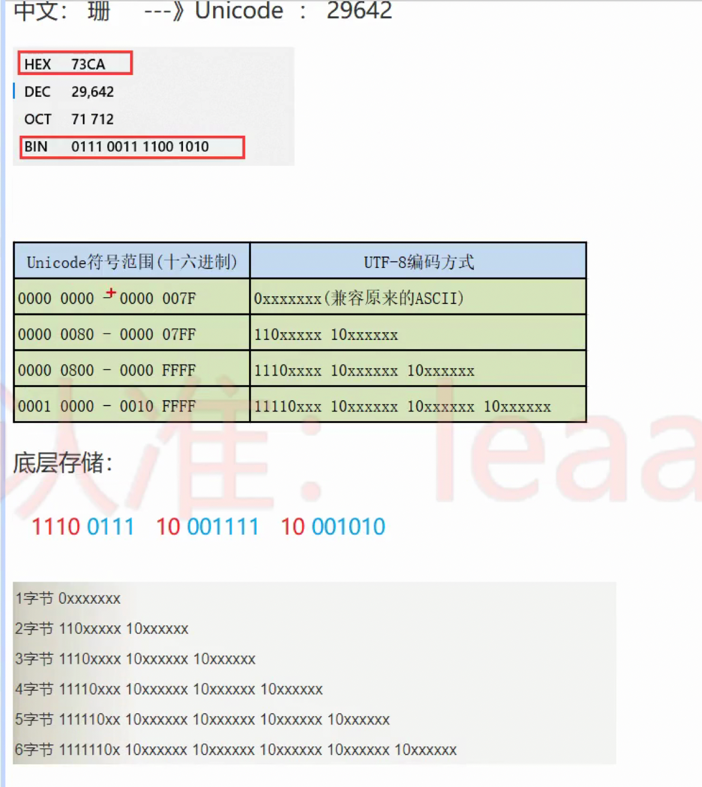
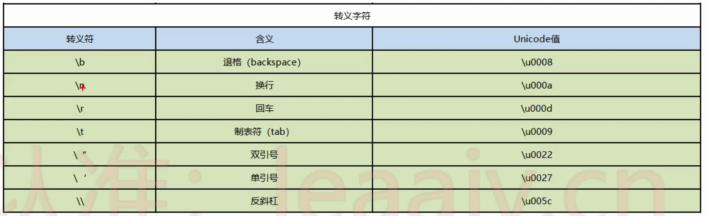
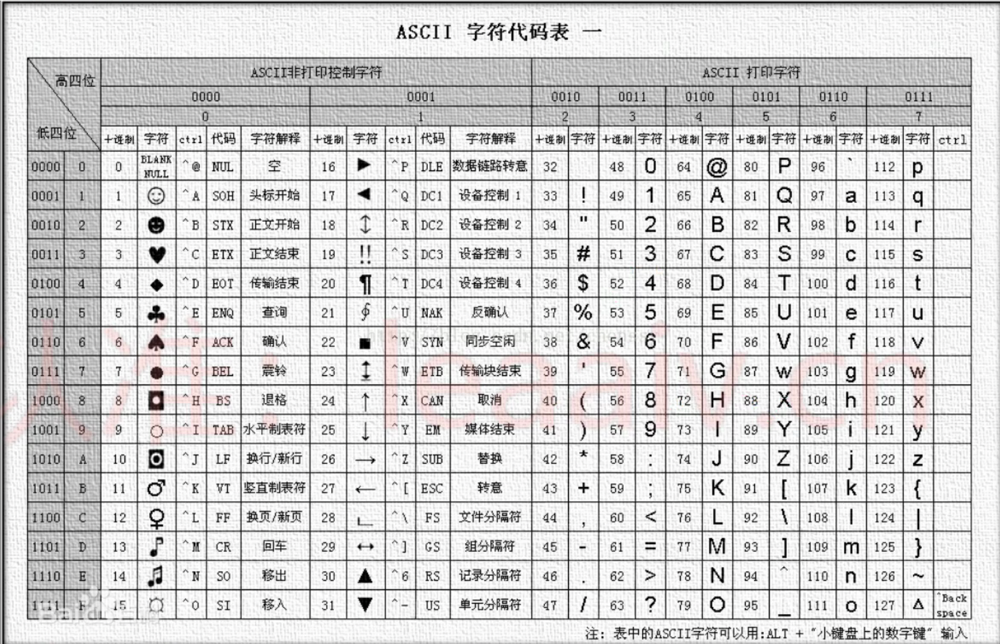

# 基本数据类型

## 整数类型

- byte 1 字节 -2^7 - 2^7 - 1 (-128 - 127)
- short 2 字节 -2^15 - 2^15 - 1 (-32768 - 32767)
- int 4 字节 -2^31 - 2^31 - 1 (-2147483648 - 2147483647) 约 21 亿
- long 8 字节 -2^63 - 2^63 - 1

```java
public  class  DataType{
	public static void main (String[] args){
		int num1 = 12;

		int num2 = 012;

		int num3 = 0b10;

		int num4 = 0x12;


		byte b = 126;

		short s = 2000;


		int i = 1234;


		// 整数类型默认就是 int 类型， 所以12345678910是一个int类型的数，对于int类型来说，他超出范围了
		// 要想把一个数给long类型变量，那么后面加上 L（推荐）或者 l 就可以了
		long num5 = 12345678910L;

		// 注意：只有这个数超出int 类型的范围了后面 才需要加上L，否则无需加L也可以赋值给long类型

		long num6 = 9527;


		System.out.println(num6);
		System.out.println(num5);

	}
}
```

## 浮点类型

- flot 4 字节 大约 ± 3.40282347E+38F （有效位数 为 6-7 位左右）
  - 32 位 1 位是符号位 8 位是指数位 23 位是尾数位
  - flot 类型又被称为单精度类型，尾数可以精确到 7 位有效数字，在很多情况下，float 类型的精度很难满足需求。
  - flot 类型的数值有一个后缀 F 或者 f，没有后缀 F/f 的浮点数值默认为 double 类型。也可以在浮点类型后添加后缀 D 或者 d，以明确其为 double 类型。
- double 8 字节 大约 ± 1.79769313486231570E308（有效位数 为 15-16 位左右
  - 64 位 1 位是符号位 11 位是指数位 52 位是尾数位
  - double 类型的数值精度约是 float 类型的两倍，又被称作双精度类型，绝大部分应用程序都采用 double 类型。

> 有效位数指的是从左开始第一个不为 0 的数到最后一个数

- 常量的两种形式

1. 十进制数形式，例如
   3.14 314.0 0.319
2. 科学记数法形式，例如
   314e2 314E2(E 的大小写没有区分) 314E-2
   ```java
    double f = 314e2; // 314 * 10 ^ 2 -> 31400.0
    double f2 = 314E-2; // 314 * 10 ^ (-2) -> 3.14
   ```

```java
public class DataType2{
	public static void main (String [] args){
		// 浮点类型的常量有两种形式：
		// 十进制形式：
		double num1 = 3.14;
		System.out.println(num1);


	 	// 科学计数法形式

	 	double num2 = 314E-2;
	 	System.out.println(num2);


	 	// 浮点类型的变量
	 	// 注意：浮点类型默认是double类型的，要想将一个double类型的数赋给float类型，必须后面加上F或者f

	 	float f1 = 3.1423456789923323F;
	 	System.out.println(f1);

	 	// 注意：double类型后面可以加D或者d, 但是一般我们都省略不写
	 	double d1 = 3.1423456789333D;

	 	System.out.println(d1);

	 	// 注意：我们最好不要进行浮点类型的比较

	 	float f2 = 0.3F;
	 	double d2 = 0.3;

	 	System.out.println(f2 == d2);
	}
}

```

## 编码和字符集

### 编码

编码是信息从一种形式或格式转换为另一种形式的过程，也称为计算机编程语言的代码简称编码。用预先规定的方法将文字、数字或其它对象编成数码，或将信息、数据转换成规定的电脉冲信号。编码在电子计算机、电视、遥控和通讯等方面广泛使用。编码是信息从一种形式或格式转换为另一种形式的过程。解码，是编码的逆过程。

### 字符集

编码用到编码表就叫做字符集

- ASCLL
  英文字符集
  用一个字节的 7 位表示
- IOS8859-1
  西欧字符集
  用一个字节的 8 位表示
- GB2312
  简体中文字符集
  最多使用两个字节编码

  PS：中文 2 个字节 2^16 65535
  GB2312 兼容了 ASCLL 码中的字符

- GBK
  GB2312 的升级，加入了繁体字
  最多使用两个字节编码

疑问：
GB2312 与 GBK 兼容的 ascll 码 还是 用 1 个字节去表示，中文用两个字节去表示。
那在解码的过程中是如何判断每个字节是对应一个字符还是两个字节对应一个字符呢？

答：
字符集一般会设置一个首位，首位如果是 0，一个字节则代表一个字符。首位如果是 1 那么代表需要加上后面的字节才能完成的表示一个字符。

- Unicode
  国际通用字符集，融合了目前人类使用的所有字符。为每个字符分配唯一的字符码。
  遇到了和 GBK 一样的问题，假如用首位表示需要几个字节来对应一个编码的话，那两个字节表示的可能性就减少了一半。
  为了解决这个问题推出了 UTF 编码方案

- UTF-8 UTF-16 UTF-32

  > 以 UTF-8 为例，最多可以用 6 个字节表示

  

## 字符类型

- Java 中使用单引号来表示字符常量，字符在内存中占两个字节。char 本质上是 UTF-16 编码，char 中只能存放下 UTF-16 编码下只占 2 字节的那些字符。

char 类型用来表示在 Unicode 编码中的字符。Unicode 编码被设计用来处理各种语言的文字，他占 2 个字节，可允许有 65535 个字符。

- 转义字符
  
- ASCLL 码
  

```java
public class DataType3{
	public static void main(String[] args){
		// 定义字符类型的变量
		char ch1 = 'a';
		System.out.println(ch1);

		char ch2 = 'A';
		System.out.println(ch2);

		char ch3 = '4';
		System.out.println(ch3);

		char ch4 = '中';
		System.out.println(ch4);

		char ch5 = '?';
		System.out.println(ch5);

		// 字符类型：单引号引起来的单个字符
		char ch6 = ' ';
		System.out.println(ch6);

		// Java 中无论 字母、数字、符号、总问都是字符类型的常量，都占用2个字节。


		System.out.println("---------------------------");

		/**
		 *
		 * 转义字符：将后面的普通字符转换为特殊含义
		 *
		 *
		*/

		char ch7 = '\n';


		System.out.println("aaa" + ch7 + "bbb");

		System.out.println("---------------------------");

		char cha = 'A';

		System.out.println(cha);//A

		System.out.println(cha + 90); // 155

		System.out.println(155 - cha); // 90

		// char类型我们看到的样子就是它本身的字面常量，但是底层在计算的时候，实际上是按照一个码进行计算的。
		// 这个码局势ASCLL码
		// 之前说char类型是按照Unicode码进行存储的，Unicode兼容了 ASCLL码， Unicode前128位是ASCLL码

		char chz = '中';
		System.out.println(chz + 1);


		int num1 = (int)chz;
		System.out.println(num1); //20013

		char ch = (char)num1;
		System.out.println(ch);

		int num2 = '中'; //20013

		char chn = 20013;
		System.out.println(chn);//中


		char ch9 = '2'+ 2; //  '2' -> 50   50 + 2 = 52

		System.out.println(ch9); // 52 对应的 ASCLL码是 '4'
	}
}
```

## 布尔类型

boolean 类型有两个常量值，true 和 false， 在内存中占一位（不是一个字节），不可以使用 0 或者非 0 的整数代替 true 和 false，这点和 c 语言不同。boolean 类型用来判断逻辑条件，一般用来程序的流程控制。

## 基本数据类型的转换

```java
public class DataType4{
	public static void main(String[] args){


		double d = 6;//int -> double 自动类型转换


		System.out.println(d);


		int i = (int)6.5;// double -> int 强制类型转换
		System.out.println(i);


		// 在同一个表达式中，有多个数据类型的时候，应该如何处理

		// 多种数据类型参与运算的时候，整数类型，浮点类型，字符类型都可以参与运算，唯独布尔类型不可以参与运算


		// double d2 = 12 + 1294L + 8.5F + 3.81 + 'a' + true;

		double d2 = 12 + 1294L + 8.5F + 3.81 + 'a';

		System.out.println(d2);


		/**
		 * 类型级别：（从低到高）
		 * byte,short,char, -> int -> long -> float -> double
		 * 级别用来做什么？当一个表达式中有多重数据类型的时候，要找出当前表达式中级别最高的那个类型，然后
		 * 其余的类型都转换为当前表达式中级别最高的类型进行计算
		 *
		 * double d2 = 12 + 1294L + 8.5F + 3.81 + 'a';
		 * 			 = 12.0 + 1294.0 + 8.5 + 3.81 + 97.0
		 *
		 *
	    */

	    int i2 = (int)(12 + 1294L + 8.5F + 3.81 + 'a'); // 右侧计算的结果是double类型 需要强转

	    System.out.println(i2);

	    /**
	     *
	     * 在进行运算的时候比较两边类型的级别：
	     * 左 = 右：直接赋值
	     * 左 < 右：强转
	     * 左 > 右: 直接自动转换
	     *
		*/

		// 以下情况属于特殊情形：对于byte，short， char 类型来说，只要在他们的表数范围内，赋值的时候就不需要进行
		// 强转了直接赋值即可。


		byte b = 13;  //整数默认是 int 类型  占4 字节 13在 byte的范围中 这样是可以的

		byte b2 = (byte)280; //超过范围了就需要强转了
	}
}
```

## final

- 一个变量被 final 修饰，这个变量就变成了一个常量，这个常量的值就不可变了
- 这个常量就是我们所说的 字符常量 ---- 例如下面的 PI 变量
- 约定俗成的规定：字符常量的名字全部大写

```java
import java.util.Scanner;

public class DataType5{
	public static void main (String [] args){


		final double PI = 3.14;  // 加 final 修饰后  定义好 就不能更改


		Scanner sc = new Scanner(System.in);
		System.out.println("请录入一个半径");

		int r = sc.nextInt();

		double c = 2 * PI * r;

		System.out.println(c);


		double s = PI * r * r;

		System.out.println(s);
	}
}
```
