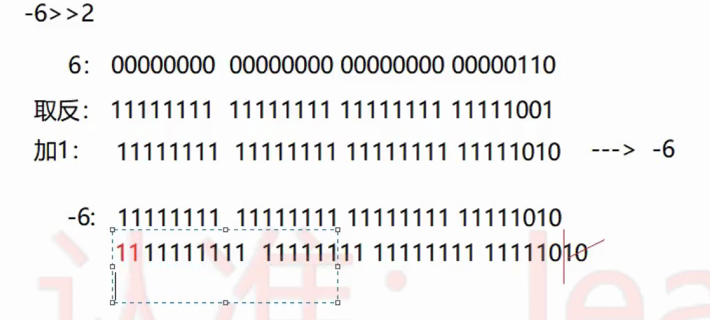
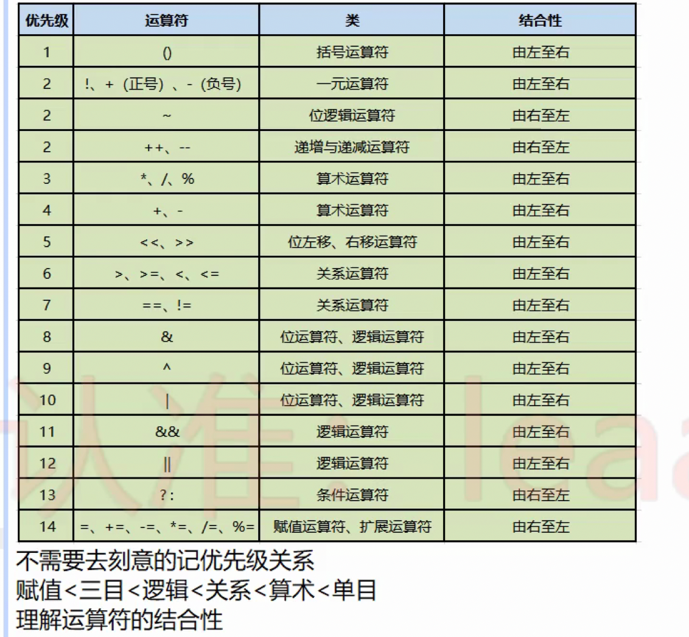

# 运算符

## 逻辑运算符

& | && ||

逻辑与/或 ： 只要有一个操作数是 false ，那么结果一定是 false

短路与/或 ： 效率高一些，只要第一个表达式是 false，那么第二个表达式就不用计算了，结果一定是 false

## 位运算

如何区分逻辑运算符和位运算符
逻辑运算符：左右链接的是布尔类型的操作数
位运算符：左右链接的是具体的数值

### 左移 <<

- 左移一位 相当于 乘以 2

3 << 2 = ?
3 -> 0011 左移两位 -> 1100 -> 12

4 乘以 8 最快的方式 4 << 3

### >> 有符号右移

> 有符号位移 代表的是 补齐的时候 用符号位补齐，无符号位移代表的是 补齐的时候 用 0 补齐

6 >> 2 = ? 0110 -> 0001 = 1 用 0 补齐
-6 >> 2 = ? 用 1 补齐

### >>> 无符号右移

6 >> 2 = ? 0110 -> 0001 = 1

### 运算符的优先级

单目运算符 例如 !true 就是一个运算符 后面接上一些东西

